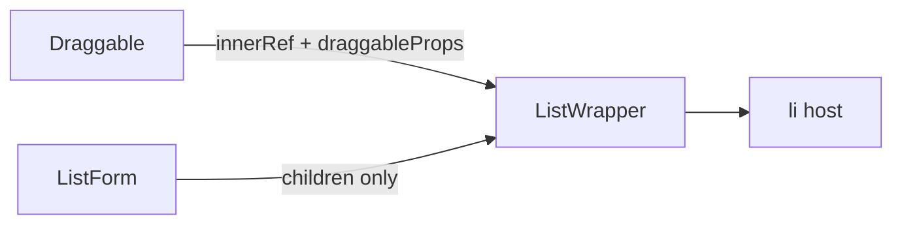

# ListsContainer, colocation, domain names

One PR. Freeze-allowed cleanup (layout + naming). **No product behavior change.** Not a coverage-ratchet P (`app/` still mostly outside All-files include).

## Locked decisions

- **Folders:** Next `_components` + existing [folder colocation](docs/conventions.md) — **one folder per public widget**, `index.tsx` named after the folder, **sibling files** (same as [`card-modal/`](components/modals/card-modal/)). Do not nest `list-item/`. Shared-by-two stays in the parent folder (`ListWrapper` in `lists-container/`).
- **Shell:** **`ListsContainer`** (`*Container` = stateful shell). **`ListWrapper`** stays (`*Wrapper` = presentational `children` chrome, no domain payload). Feature row in docs stays **“Board canvas”**.
- **Props/locals:** React/Next name the value (`products`, `post`). Ours: **`lists` / `list` / `board` / `card` / `auditLog(s)`**. Ban generic UI `data`.
- **Actions:** Next form actions use `formData`. Ours receive `InputType`: **destructure at the handler parameter**. Bag name **`input`** only if the whole object is required. Unused bag ([`actions/stripe-redirect/index.ts`](actions/stripe-redirect/index.ts)): **`_input`**. Keep `return { data }` (`ActionState`).
- **`useAction`:** Return field **`data`** stays (mirrors `ActionState`). `execute` already takes `input`. Align `Action` type `(data: TInput)` → `(input: TInput)`. Call-site `onSuccess` callbacks use the entity (`list`, `board`, `card`, `url`).
- **Out:** `BoardCanvas`, recursive folders, Atomic/FSD, `features/`, `list-dnd.types.ts`, extracting reorder to `lib/`.

**Keep library `data`:** Prisma `create({ data: })`, `HandlerActionResult.data`, `useQuery().data`, unsplash-js `{ data }`, Stripe `price_data`, Next `metadata`, `FormData`, Zod `safeParse` `.data`, reorder schema field `items`.

## Target trees

```text
board/[boardId]/_components/
  board-navbar/
    index.tsx                  → BoardNavbar
    board-title-form.tsx (+ test)
    board-options.tsx (+ test)
  lists-container/
    index.tsx                  → ListsContainer
    index.test.tsx             ← move list-container.test.tsx
    list-wrapper.tsx
    list-item.tsx
    list-form.tsx (+ test)
    list-header.tsx (+ test)
    list-options.tsx (+ test)
    card-item.tsx
    card-form.tsx (+ test)

(dashboard)/_components/
  dashboard-navbar/
    index.tsx                  → DashboardNavbar
    mobile-sidebar.tsx (+ test)
    theme-toggler.tsx
  dashboard-sidebar/
    index.tsx                  → DashboardSidebar
    nav-item.tsx
```

**Call sites after move**

- Board page: `import { ListsContainer } from "./_components/lists-container"` then `<ListsContainer boardId={boardId} lists={lists} />`
- Board layout: `./_components/board-navbar`
- Dashboard layout: `./_components/dashboard-navbar` (unchanged path string; file is now a folder)
- Org layout [`organization/layout.tsx`](<app/(platform)/(dashboard)/organization/layout.tsx>): still `../_components/dashboard-sidebar`
- Mobile sidebar: `import { DashboardSidebar } from "../dashboard-sidebar"`
- Activity page: `import { ActivityList } from "./_components/activity-list"`
- Activity still imports `OrganizationInfo` from `../_components/organization-info` (home + activity share it)

**Move:** [`activity-list.tsx`](<app/(platform)/(dashboard)/organization/[organizationId]/_components/activity-list.tsx>) → `activity/_components/activity-list.tsx`.

**Leave:** marketing navbar/footer, billing `subscription-button`, `components/form/`, `components/ui/`, `card-modal/` (props only), `pro-modal.tsx`, `providers/*`, `board-list`, `organization-control`.

## Domain rename map

| Today                                                                   | To                                                 |
| ----------------------------------------------------------------------- | -------------------------------------------------- |
| `ListContainer` `data`                                                  | `lists`                                            |
| `ListItem` / `ListHeader` / `ListOptions` `data`                        | `list`                                             |
| `CardItem` / card-modal header, description, actions `data`             | `card`                                             |
| `BoardNavbar` / `BoardTitleForm` `data`                                 | `board`                                            |
| `ActivityItem` `data`                                                   | `auditLog`                                         |
| `CardModalActivity` `items`                                             | `auditLogs`                                        |
| `const { data: cardData }` / `cardAuditLogsData`                        | `const { data: card }` / `cardAuditLogs`           |
| `handler = async (data: InputType)`                                     | `async ({ … }: InputType)` or `(input: InputType)` |
| `createSafeAction` wrapper `(data: TInput)` / handler `(validatedData)` | `(input: TInput)`                                  |
| `useAction` `Action` `(data: TInput)`                                   | `(input: TInput)`                                  |
| `onSuccess: (data) =>` at call sites                                    | entity name (`list` / `board` / `card` / `url`)    |

All 14 handlers under [`actions/`](actions/) plus `stripe-redirect` (`_input`). Tests: JSX props and stubs ([`list-container.test.tsx`](<app/(platform)/(dashboard)/board/[boardId]/_components/list-container.test.tsx>) `ListItem` stub, card-modal child stubs).

## ListWrapper + ListItem (must not nest `<li>`)

Today [`ListWrapper`](<app/(platform)/(dashboard)/board/[boardId]/_components/list-wrapper.tsx>) is a bare `<li>` + `children`. [`ListItem`](<app/(platform)/(dashboard)/board/[boardId]/_components/list-item.tsx>) puts **Draggable** on its **own** `<li>` (`ref` + `draggableProps`). Nesting `<li>` is invalid HTML.

Follow [Refs (React 19)](docs/conventions.md) — `ref` as a prop, no `forwardRef`. Match [`skeleton-status.tsx`](components/skeleton-status.tsx): host `ComponentProps` + `cn`.

```tsx
import type { ComponentProps } from "react";
import { cn } from "@/lib/utils";

export const ListWrapper = ({
  className,
  children,
  ...props
}: ComponentProps<"li">) => {
  return (
    <li
      className={cn("h-full w-68 shrink-0 select-none", className)}
      {...props}
    >
      {children}
    </li>
  );
};
```

`ListItem` (Draggable render prop):

```tsx
<ListWrapper
  {...provided.draggableProps}
  ref={provided.innerRef}
>
```

`ListForm` stays `<ListWrapper>{…}</ListWrapper>` (no extra props). Do **not** add `"use client"` on `ListWrapper` (only imported from client parents).



## ESLint (after the rename, same PR)

On `components/**` except `ui/`, plus `app/**/_components/**`: ban identifier **`data` as a component prop / JSX attribute** (`JSXAttribute` name `data`, plus TS property `data` on `*Props` interfaces). **Do not** match `data-*` attributes, `result.data`, Prisma `data:`, or `const { data: card }`.

Flat config **replaces** `no-restricted-syntax` — **re-spread** prior entries on overlapping globs ([`docs/testing.md`](docs/testing.md), [`eslint.config.mjs`](eslint.config.mjs)).

## Docs (same PR)

- [`docs/conventions.md`](docs/conventions.md): colocation example `lists-container/` next to `card-modal/`; role affixes add `*Container` vs `*Wrapper` (common practice, Adopted); domain names vs library `data`; `BoardTitleForm board=`; keep ActionState table `data`.
- [`docs/project-structure.md`](docs/project-structure.md): nearest-route `_components` (billing + activity). Do **not** document recursive/shallow/leaf-compound-kit.
- Path rewires: [`docs/features.md`](docs/features.md), [`docs/testing.md`](docs/testing.md) (`listWithMissingCards` path), [`docs/data.md`](docs/data.md), [`docs/billing.md`](docs/billing.md) if a path changes. Feature row stays “Board canvas”.
- [`.cursor/plans/vitest_test_backlog_c23a3686.plan.md`](.cursor/plans/vitest_test_backlog_c23a3686.plan.md) follow-up → this PR. Historical P3 can keep shipped names.

## Implementation order

Do **not** land the ESLint ban before the rename — lint would be red mid-PR.

1. Domain names in **current** paths (UI props, tests/stubs, Query aliases, action handlers, [`lib/create-safe-action.ts`](lib/create-safe-action.ts), [`hooks/use-action.ts`](hooks/use-action.ts) `Action` param only, `onSuccess` call sites). Keep `useAction` return `data` and `onSuccess?: (data: TOutput)` in the **type** (ActionState mirror); only call-site bindings change.
2. Conventions + ESLint (locks the rule).
3. `git mv` board folders; export `ListsContainer`; ListWrapper forward + ListItem.
4. `git mv` dashboard folders; fix imports listed above.
5. Move `activity-list`; fix activity page import.
6. Path docs + backlog + grep (`ListContainer`, `list-container`, UI `data=`).
7. `pnpm lint` · `pnpm test:run` · `pnpm test:coverage:paths` on peers that **already have** suites: `lists-container/index`, `board-title-form`, `board-options`, `list-form` / `list-header` / `list-options`, `card-form`, `card-modal*`, `activity-item`, `mobile-sidebar`, plus `use-action` / `create-safe-action` if their tests exist and were touched. Do not add coverage for files that had none.
