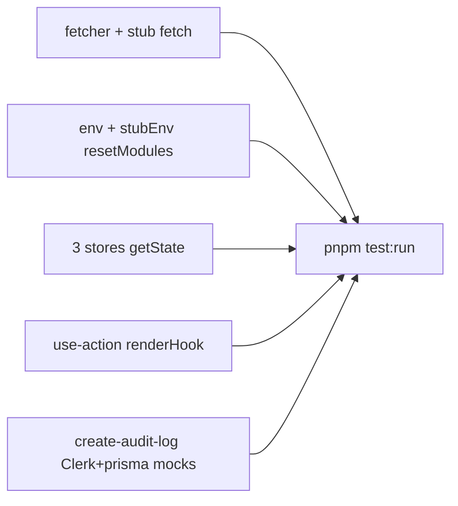

# Vitest P1 — mocked unit suites

**Status:** done — branch `test/vitest-p1-mocked-unit` → [PR #7](https://github.com/manhcuongdtbk/taskify/pull/7). Parent backlog: [`vitest_test_backlog_c23a3686.plan.md`](vitest_test_backlog_c23a3686.plan.md).

**Look-back for P2+:** reuse stub/mock vocabulary in [`docs/testing.md`](../../docs/testing.md); `vi.stubGlobal("fetch")` / `vi.stubEnv` + `resetModules` / store `.getState()` + `close()` reset / `renderHook` + stable options / Clerk + `@/lib/prisma` `vi.mock` factories (no `vitest-mock-extended`).

Original delivery shape: branch from `main`, add colocated suites, `pnpm test:run` green, update backlog, self-review, push, open PR.

SoT: [`docs/testing.md`](docs/testing.md) (doubles + Prisma mocking). Style: P0 suites (`import { … } from "vitest"`, behavior-named tests, `test.for` where tabular, `toStrictEqual` / `toHaveBeenCalledExactlyOnceWith`). **No** `vitest-mock-extended`. **Do not** re-open `create-safe-action` or unit-test `lib/prisma.ts` / `subscription` / `organization-limit`.



## Suites to add

### 1. [`lib/fetcher.test.ts`](lib/fetcher.ts)

- Stub `globalThis.fetch` with `vi.fn()` (restore via `restoreMocks` / `afterEach` as needed).
- Happy: `ok: true` + `json()` → resolves to body; fetch called with the URL.
- Error: `ok: false` → rejects with `Request failed: ${status} ${statusText}` (throw before `json()`).

### 2. [`lib/env.test.ts`](lib/env.ts)

Constants are evaluated at **module load**, so call-time `stubEnv` alone is not enough (unlike `absoluteUrl` in [`lib/utils.test.ts`](lib/utils.test.ts)).

- Per case: `vi.stubEnv("NODE_ENV", …)` → `vi.resetModules()` → dynamic `import("./env")`.
- `afterEach`: `vi.unstubAllEnvs()`.
- Cases: `"development"` → `isDevelopment` true / `isProduction` false; `"production"` inverse; `"test"` (and optionally another non-dev/prod value) → both false.

### 3. Store suites (Node, no RTL)

Colocate next to each store; drive via `.getState()` / actions (module singletons — reset with `close()` or `setState` in `beforeEach`/`afterEach`).

| File                                                                            | Assert                                                                                     |
| ------------------------------------------------------------------------------- | ------------------------------------------------------------------------------------------ |
| [`stores/use-pro-modal-store.test.ts`](stores/use-pro-modal-store.ts)           | initial closed; `open` / `close`                                                           |
| [`stores/use-mobile-sidebar-store.test.ts`](stores/use-mobile-sidebar-store.ts) | same                                                                                       |
| [`stores/use-card-modal-store.test.ts`](stores/use-card-modal-store.ts)         | initial `id` undefined; `open(id)` sets id+open; `close` clears; second `open` replaces id |

Do **not** add a separate `create-store` suite (out of P1 list).

### 4. [`hooks/use-action.test.tsx`](hooks/use-action.ts)

First hook suite: `@testing-library/react` `renderHook` + `act` / `waitFor`. Stable `options` object (or `vi.fn` callbacks defined outside the hook call) so deps don’t churn.

- Success: `data` set, `onSuccess` then `onComplete`; `isLoading` true→false.
- `serverError`: sets error, `onError`, not `onSuccess`; `onComplete` runs.
- Field/form errors from result reflected; no success callback.
- Falsy/`undefined` action result: early return, no crash, loading cleared, `onComplete` still runs.

### 5. [`lib/create-audit-log.test.ts`](lib/create-audit-log.ts) — first Prisma Client mock

Match the factory shape already documented in [`docs/testing.md`](docs/testing.md) (prefer inline factory over new `lib/__mocks__/prisma.ts` for this single-method surface):

```ts
vi.mock("@/lib/prisma", () => ({
  default: { auditLog: { create: vi.fn() } },
}));
vi.mock("@clerk/nextjs/server", () => ({
  auth: vi.fn(),
  currentUser: vi.fn(),
}));
```

- Happy: Clerk returns `orgId` + user → `auditLog.create` called with `data` containing org/entity/action/user fields (`userName` = `firstName + " " + lastName`); success returns `undefined`.
- Missing `orgId` or `user` → `{ error: "Failed to create audit log" }`; `create` **not** called.
- `create` rejects → same error object (optional: spy `console.log` for `[AUDIT_LOG_ERROR]`).

## Delivery checklist

1. Branch from `main`: `test/vitest-p1-mocked-unit`.
2. Add the seven colocated test files above; no production refactors unless a test forces a tiny fix (prefer documenting current behavior, e.g. audit-log swallow).
3. `pnpm test:run` green.
4. Mark `p1-mocked-unit` completed in the backlog plan + refresh overview (P1 done; P2+ still TODO).
5. Self-review, push, `gh pr create` (same cadence as [PR #5](https://github.com/manhcuongdtbk/taskify/pull/5)).
