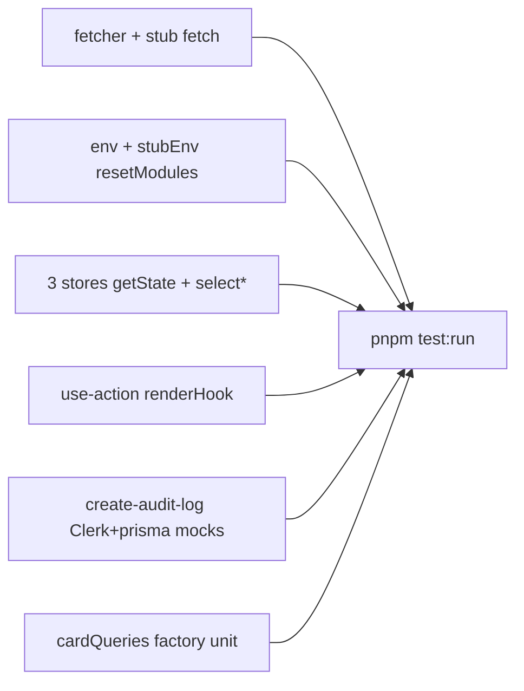

# Vitest P1 — mocked unit suites

**Status:** done — branch `test/vitest-p1-mocked-unit` → [PR #7](https://github.com/manhcuongdtbk/taskify/pull/7). Parent backlog: [`vitest_test_backlog_c23a3686.plan.md`](vitest_test_backlog_c23a3686.plan.md).

SoT: [`docs/testing.md`](../../docs/testing.md) (doubles + Prisma mocking · freeze/ratchet). Style: P0 suites (`import { … } from "vitest"`, behavior-named tests, `test.for` where tabular, `toStrictEqual` / `toHaveBeenCalledExactlyOnceWith`, [expects follow execution order](../../docs/testing.md)). **No** `vitest-mock-extended`. Deferred: `lib/prisma.ts` singleton, `subscription` / `organization-limit`.

## What landed / patterns to reuse (P2+)

| Pattern                            | Where                                                                    | Reuse as                                                                                                                                 |
| ---------------------------------- | ------------------------------------------------------------------------ | ---------------------------------------------------------------------------------------------------------------------------------------- |
| Stub `fetch`                       | [`lib/fetcher.test.ts`](../../lib/fetcher.test.ts)                       | `vi.stubGlobal` / `vi.fn` Response; assert URL then body                                                                                 |
| Module-load env                    | [`lib/env.test.ts`](../../lib/env.test.ts)                               | `vi.stubEnv` → `vi.resetModules()` → dynamic `import`; `unstubAllEnvs` in `afterEach`                                                    |
| Zustand via `getState()`           | [`stores/*.test.ts`](../../stores/)                                      | Reset with `close()`; no RTL for pure store behavior                                                                                     |
| Derived `select*`                  | [`stores/use-card-modal-store.ts`](../../stores/use-card-modal-store.ts) | Open ⇔ `id` set — `selectCardModalIsOpen`; don’t store a duplicate `isOpen` flag ([`client-ui-state.md`](../../docs/client-ui-state.md)) |
| Hook + callbacks                   | [`hooks/use-action.test.tsx`](../../hooks/use-action.test.tsx)           | `renderHook` + `act` / `waitFor`; stable `options` / `vi.fn` outside the hook                                                            |
| Clerk + Prisma `vi.mock` factories | [`lib/create-audit-log.test.ts`](../../lib/create-audit-log.test.ts)     | Inline factory for the methods under test; cast mock resolved values to `Awaited<ReturnType<…>>` when needed                             |
| Query resource factory unit suite  | [`lib/api/card.test.ts`](../../lib/api/card.test.ts)                     | Assert keys; invoke `queryFn` with the cast pattern in [`docs/testing.md`](../../docs/testing.md) (Query `queryFn` context)              |
| Expect order                       | all P1 suites                                                            | Calls / side effects first, then result ([hard rule](../../docs/testing.md))                                                             |

Freeze + coverage ratchet: [`docs/testing.md`](../../docs/testing.md) · ledger in [`vitest_test_backlog_c23a3686.plan.md`](vitest_test_backlog_c23a3686.plan.md) (fill **after** P1 merges).



## Suites shipped

### 1. [`lib/fetcher.test.ts`](../../lib/fetcher.ts)

- Stub `globalThis.fetch` with `vi.fn()` (`restoreMocks` / `afterEach` as needed).
- Happy: `ok: true` + `json()` → resolves to body; fetch called with the URL.
- Error: `ok: false` → rejects with `Request failed: ${status} ${statusText}` (throw before `json()`).

### 2. [`lib/env.test.ts`](../../lib/env.ts)

Constants are evaluated at **module load**, so call-time `stubEnv` alone is not enough (unlike `absoluteUrl` in [`lib/utils.test.ts`](../../lib/utils.test.ts)).

- Per case: `vi.stubEnv("NODE_ENV", …)` → `vi.resetModules()` → dynamic `import("./env")`.
- `afterEach`: `vi.unstubAllEnvs()`.
- Cases: `"development"` → `isDevelopment` true / `isProduction` false; `"production"` inverse; `"test"` → both false.

### 3. Store suites (Node, no RTL)

Drive via `.getState()` / actions (module singletons — reset with `close()` in `beforeEach`/`afterEach`).

| File                                                                                  | Assert                                                                                                                            |
| ------------------------------------------------------------------------------------- | --------------------------------------------------------------------------------------------------------------------------------- |
| [`stores/use-pro-modal-store.test.ts`](../../stores/use-pro-modal-store.ts)           | initial closed; `open` / `close`                                                                                                  |
| [`stores/use-mobile-sidebar-store.test.ts`](../../stores/use-mobile-sidebar-store.ts) | same                                                                                                                              |
| [`stores/use-card-modal-store.test.ts`](../../stores/use-card-modal-store.ts)         | initial `id` undefined; `open(id)` sets id; `selectCardModalIsOpen` true while open; `close` clears id; second `open` replaces id |

No separate `create-store` suite (out of P1 list; incidental import coverage ≠ ownership).

### 4. [`hooks/use-action.test.tsx`](../../hooks/use-action.ts)

`renderHook` + `act` / `waitFor`. Stable `options` / `vi.fn` callbacks so deps don’t churn.

- Success: `data` set, `onSuccess` then `onComplete`; `isLoading` true→false.
- `serverError`: sets error, `onError`, not `onSuccess`; `onComplete` runs.
- Field/form errors from result reflected; no success callback.
- Falsy/`undefined` action result: early return, no crash, loading cleared, `onComplete` still runs.

### 5. [`lib/create-audit-log.test.ts`](../../lib/create-audit-log.ts) — first Prisma Client mock

```ts
vi.mock("@/lib/prisma", () => ({
  default: { auditLog: { create: vi.fn() } },
}));
vi.mock("@clerk/nextjs/server", () => ({
  auth: vi.fn(),
  currentUser: vi.fn(),
}));
```

- Happy: Clerk returns `orgId` + user → `auditLog.create` with org/entity/action/user fields (`userName` = `firstName + " " + lastName`); success returns `undefined`.
- Missing `orgId` or `user` → `{ error: "Failed to create audit log" }`; `create` **not** called.
- `create` rejects → same error object.

### 6. Also in this PR (hygiene while writing suites)

Allowed under freeze for colocated-test / store·Query hygiene — [`docs/testing.md`](../../docs/testing.md):

| Change                                                                                            | Why                                                                                                                            |
| ------------------------------------------------------------------------------------------------- | ------------------------------------------------------------------------------------------------------------------------------ |
| [`lib/api/card.ts`](../../lib/api/card.ts) + [`lib/api/card.test.ts`](../../lib/api/card.test.ts) | Move card Query factories to `lib/api` with `queryOptions`; unit-cover keys + `queryFn` URLs ([`data.md`](../../docs/data.md)) |
| `selectCardModalIsOpen` + ESLint `select*` exports                                                | Derive open from `id`; card-modal consumers updated ([`client-ui-state.md`](../../docs/client-ui-state.md))                    |
| Expect-order polish on [`lib/create-safe-action.test.ts`](../../lib/create-safe-action.test.ts)   | Align with hard rule (suite already from P0)                                                                                   |

## Historical delivery notes

Original shape (completed): branch from `main`, add colocated suites, `pnpm test:run` green, update backlog, self-review, push, open PR (same cadence as [PR #5](https://github.com/manhcuongdtbk/taskify/pull/5)). Production changes beyond suite peers were **store/Query hygiene** forced by or paired with those suites — not open-ended product work.
