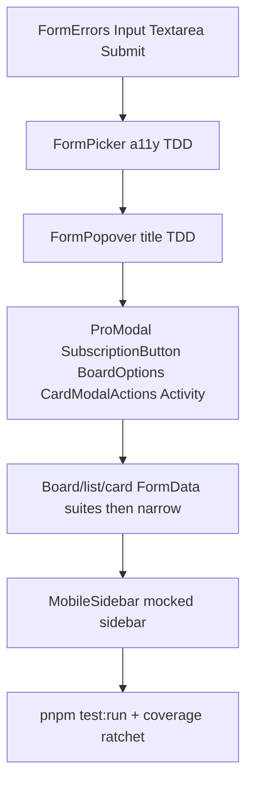

# Vitest P2 — component static + interactive

**Cadence:** one branch `test/vitest-p2-components` from up-to-date `main`, one PR (same as P0/P1). Keep this plan under [`.cursor/plans/`](.cursor/plans/) and mark backlog todos done when green.

**SoT:** [`docs/testing.md`](docs/testing.md) (jsdom + Testing Library + jest-dom; `userEvent.setup()` before `render`; expect order; freeze/ratchet; Fixing bugs with tests). Style: P1 look-back [`vitest_p1_mocked_unit_c7e24825.plan.md`](.cursor/plans/vitest_p1_mocked_unit_c7e24825.plan.md). Parent: [`vitest_test_backlog_c23a3686.plan.md`](.cursor/plans/vitest_test_backlog_c23a3686.plan.md).

**Coverage:** each new `*.test.tsx` → `pnpm test:coverage:paths <peer>` at **100%** stmts/branch/funcs/lines. End of P: `pnpm test:coverage` All files stmts **> 27.27%** (P1 ledger); other metrics must not regress. Do **not** shrink or expand [`vitest.config.mts`](vitest.config.mts) `coverage.include` in this P (app/ board forms stay out of the All-files bucket; they still get peer 100% via `coverage:paths`). Defer MSW / `CardModal` shell / Unsplash happy path / list-container DnD to **P3**.

## Shared doubles (house style for first `*.test.tsx`)

- `import { describe, expect, test, vi } from "vitest"`; `import userEvent from "@testing-library/user-event"`; `render` / `screen` / `waitFor` from Testing Library.
- Mock `next/image` as a plain `` (no Vitest alias today).
- Mock `next/navigation` (`useRouter` / `useParams` / `usePathname`) per suite.
- Prefer stubbing `useAction` (expose `execute: vi.fn()`) over importing real server actions; or `vi.mock` the action module.
- Toast: spy/`vi.mock` `@/components/ui/toast` when asserting feedback.
- Unsplash: `vi.mock("@/lib/unsplash")` → reject/empty so FormPicker settles on [`defaultImages`](constants/images.ts) (no MSW).
- Real Zustand stores OK (reset via `close()`); QueryClient only where invalidate is asserted.
- Wrap form primitives that call `useFormStatus` in a `<form>` (or React `FormStatus` parent) so pending paths are reachable when needed.

## Wave 1 — Form primitives (coverage)

Colocated suites next to source under [`components/form/`](components/form/):

| Peer                                                     | Assert                                             |
| -------------------------------------------------------- | -------------------------------------------------- |
| [`form-errors.tsx`](components/form/form-errors.tsx)     | No errors → null; messages render with `aria-live` |
| [`form-submit.tsx`](components/form/form-submit.tsx)     | Renders submit button; disabled when pending/prop  |
| [`form-input.tsx`](components/form/form-input.tsx)       | Label, errors, name/id, disabled when pending      |
| [`form-textarea.tsx`](components/form/form-textarea.tsx) | Same pattern as input                              |

**Production change in Wave 1 (needed for Wave 2):** extend [`FormInput`](components/form/form-input.tsx) with optional controlled `value` + `onChange` (when `value` is set, do not pass `defaultValue`). Cover both modes in `form-input.test.tsx` so the peer stays at 100%.

## Wave 2 — TDD fixes (backlog todos)

### FormPicker a11y (`p2-form-picker-a11y`)

1. Add failing [`form-picker.test.tsx`](components/form/form-picker.tsx): mock Unsplash → `defaultImages`; after load, focus a tile, `user.keyboard("{Enter}")` / Space → `onSelect` with structured `BoardImageInput` fields from that image.
2. Confirm fail on current `div` + `onClick` only.
3. Fix: accessible control (`role="button"`, `tabIndex={0}`, Enter/Space in `onKeyDown`) **without** nesting the Unsplash attribution `<a>` inside a `<button>`. Keep click path; ignore when `pending`.
4. Also cover: click selects; checkmark when `selectedImage` matches; pending ignores; errors via `FormErrors`.

### FormPopover controlled title (`p2-form-popover-controlled-title`)

1. Add failing [`form-popover.test.tsx`](components/form/form-popover.tsx): open popover, type a title, submit **without** image (invalid) so `useAction` returns field errors; assert the typed title **still** shows in the input.
2. Confirm fail on uncontrolled `FormInput` (clears after invalid submit — inline TODO).
3. Fix: `useState` for `title` like `selectedImage`; controlled `FormInput`; `execute({ title, image: selectedImage as BoardImageInput })` with **no** FormData title read. Clear title on popover close with selection.
4. Extra coverage (same suite, peer 100%): success → toast + `router.push(paths.board(id))`; error → toast + `openProModal()`.

## Wave 3 — Thin interactive (coverage)

| Peer                                                                                                                                | Assert                                                                             |
| ----------------------------------------------------------------------------------------------------------------------------------- | ---------------------------------------------------------------------------------- |
| [`pro-modal.tsx`](components/modals/pro-modal.tsx)                                                                                  | Seed store `open()`; Upgrade → `execute({})`; success sets `location`; error toast |
| [`subscription-button.tsx`](<app/(platform)/(dashboard)/organization/[organizationId]/billing/_components/subscription-button.tsx>) | Free → `openProModal()`; Pro → `execute` → redirect                                |
| [`board-options.tsx`](<app/(platform)/(dashboard)/board/[boardId]/_components/board-options.tsx>)                                   | Delete → `execute({ id })`                                                         |
| [`card-modal-actions.tsx`](components/modals/card-modal/card-modal-actions.tsx)                                                     | Copy/delete → execute args; success closes card modal + toast                      |
| [`card-modal-activity.tsx`](components/modals/card-modal/card-modal-activity.tsx)                                                   | Renders fixture `AuditLog[]` via `ActivityItem`                                    |

**Out of P2:** [`card-modal/index.tsx`](components/modals/card-modal/index.tsx) (owns `cardQueries` — P3).

## Wave 4 — FormData cleanup (test then narrow)

Per [`docs/data.md`](docs/data.md): for each file, colocated test **submit → execute args first**, then replace `formData.get(…) as string` with `typeof x === "string" ? x : ""`. Do not mass-replace. Params casts (`params.boardId as string`) stay unless a suite already touches them; backlog FormData todos only require FormData fields.

| Todo                                 | File                                                                                                    | Execute args to assert                          |
| ------------------------------------ | ------------------------------------------------------------------------------------------------------- | ----------------------------------------------- |
| `p2-formdata-board-title-form`       | [`board-title-form.tsx`](<app/(platform)/(dashboard)/board/[boardId]/_components/board-title-form.tsx>) | `{ id, title }`                                 |
| `p2-formdata-list-form`              | [`list-form.tsx`](<app/(platform)/(dashboard)/board/[boardId]/_components/list-form.tsx>)               | `{ title, boardId }`                            |
| `p2-formdata-list-header`            | [`list-header.tsx`](<app/(platform)/(dashboard)/board/[boardId]/_components/list-header.tsx>)           | changed title → execute; unchanged → no execute |
| `p2-formdata-list-options`           | [`list-options.tsx`](<app/(platform)/(dashboard)/board/[boardId]/_components/list-options.tsx>)         | copy + delete both `{ id, boardId }`            |
| `p2-formdata-card-form`              | [`card-form.tsx`](<app/(platform)/(dashboard)/board/[boardId]/_components/card-form.tsx>)               | `{ title, boardId, listId }`                    |
| `p2-formdata-card-modal-header`      | [`card-modal-header.tsx`](components/modals/card-modal/card-modal-header.tsx)                           | `{ title, boardId, id }`; skip if unchanged     |
| `p2-formdata-card-modal-description` | [`card-modal-description.tsx`](components/modals/card-modal/card-modal-description.tsx)                 | `{ boardId, id, description }`                  |

Drive editing UI with `userEvent` (enable edit / blur / FormSubmit click) as needed; mock `useAction`’s `execute`.

## Wave 5 — Mobile sidebar

[`mobile-sidebar.tsx`](<app/(platform)/(dashboard)/_components/mobile-sidebar.tsx>): mock `DashboardSidebar` as a stub; real `useMobileSidebarStore`; mock `usePathname`. Assert mount gate, open Sheet when store open, pathname change closes.

## Close-out

1. `pnpm test:run` green.
2. Every new peer: `pnpm test:coverage:paths <path>` → 100%.
3. `pnpm test:coverage` All files stmts **> 27.27%**; branch/funcs/lines not below P1.
4. Update backlog plan: mark P2 todos completed; fill P2 ledger row **only after merge** (same rule as P1). Mark [`docs/testing.md`](docs/testing.md) TODO “Client component suites” done when this PR lands.
5. Self-review, push, open PR to `main`.

**Merged:** [PR #8](https://github.com/manhcuongdtbk/taskify/pull/8). Ledger filled after merge on `main`.

## What landed / patterns to reuse (P3+)

Wave suites as planned, plus post-wave polish on the same branch:

- [`SkeletonStatus`](../../components/skeleton-status.tsx) + **section** `.Skeleton` vs **item** `.SkeletonItem` (ESLint in [`eslint.config.mjs`](../../eslint.config.mjs)) — [`docs/conventions.md`](../../docs/conventions.md)
- Vitest hygiene: `mockReset` / `unstubGlobals` / `unstubEnvs` beside `restoreMocks` — [`docs/testing.md`](../../docs/testing.md)
- Confirmed local mirror (not optimistic) for board/list/card title forms — [`docs/data.md`](../../docs/data.md)
- Shared doubles: [`lib/testing/next/image.tsx`](../../lib/testing/next/image.tsx), [`lib/testing/tanstack-query/render-with-query.tsx`](../../lib/testing/tanstack-query/render-with-query.tsx), [`lib/testing/unsplash/get-mock-result.ts`](../../lib/testing/unsplash/get-mock-result.ts)
- Bare `vi.fn()` for Server Action mocks (error + success payloads) — [`docs/testing.md`](../../docs/testing.md)

## Explicit non-goals (P3+)

- MSW; FormPicker Unsplash happy/error network beyond stubbed defaultImages
- `CardModal` shell + Query-backed loading
- `list-container` DropResult / reorder
- Broader a11y sweeps / coverage.include + CI thresholds (P4)
- New product features (freeze)
