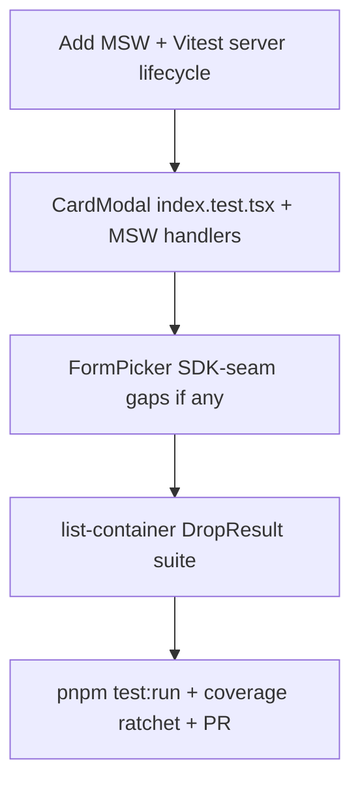

# Vitest P3 — MSW + CardModal + reorder

**Cadence:** one branch `test/vitest-p3-msw-reorder` from up-to-date `main`, one PR (same as P0–P2). Keep this plan under [`.cursor/plans/`](.cursor/plans/) — backlog todo `p3-msw-reorder` marked done.

**SoT:** [`docs/testing.md`](../../docs/testing.md) (Component + HTTP = Vitest + MSW; freeze/ratchet; expect order). Look-back: [`vitest_p2_components_85befd87.plan.md`](vitest_p2_components_85befd87.plan.md). Parent: [`vitest_test_backlog_c23a3686.plan.md`](vitest_test_backlog_c23a3686.plan.md).

**Coverage:** each new/expanded `*.test.tsx` → `pnpm test:coverage:paths <peer>` at **100%**. End of P: `pnpm test:coverage` All-files stmts **> 64.12%** (P2 ledger); other metrics must not regress. Do **not** change [`vitest.config.mts`](../../vitest.config.mts) `coverage.include` / thresholds (P4). `app/` peers (list-container) stay outside All-files include; still require peer 100% via `coverage:paths`.

## Shared doubles (house style)

- Match installed MSW docs for the version added via `pnpm add -D msw` (request `all` permissions — no project `.pnpm-store/`).
- `setupServer` lifecycle: `listen` / `resetHandlers` / `close` (global in [`vitest.setup.ts`](../../vitest.setup.ts)). Handlers under [`lib/testing/msw/handlers/`](../../lib/testing/msw/handlers/) by resource (`card.ts`) + [`helpers/`](../../lib/testing/msw/handlers/helpers/) (`stillPending`, `pendingForever`) — not a top-level `mocks/` folder per [`docs/project-structure.md`](../../docs/project-structure.md).
- Card HTTP: MSW on `/api/cards/:cardId` and `/api/cards/:cardId/audit-logs` mirroring [`app/api/cards/[cardId]/route.ts`](../../app/api/cards/[cardId]/route.ts) / [`audit-logs/route.ts`](../../app/api/cards/[cardId]/audit-logs/route.ts) (JSON body, 401 text).
- Reuse [`renderWithQuery`](../../lib/testing/tanstack-query/render-with-query.tsx) (`retry: false`).
- Do **not** re-assert `cardQueries` key/`queryFn` wiring (P1 owns [`lib/api/card.test.ts`](../../lib/api/card.test.ts)).
- Stub child modal sections in the shell suite so peer coverage stays on [`index.tsx`](../../components/modals/card-modal/index.tsx) gates (skeleton vs loaded), not retesting header/description/actions/activity.
- Real Zustand `useCardModalStore` OK (`open` / `close` reset).

## Wave 1 — MSW harness

1. `pnpm add -D msw` (global store, `required_permissions: ["all"]`).
2. Add shared server + empty default `handlers` array under `lib/testing/msw/`; domain handlers as `handlers/<resource>.ts` applied with `server.use`.
3. Wire lifecycle into [`vitest.setup.ts`](../../vitest.setup.ts) alongside existing jest-dom + RTL `cleanup`.
4. Light SoT note in [`docs/testing.md`](../../docs/testing.md): mark the “MSW when Query-backed UI needs HTTP mocks” TODO done; point at the setup module (no essay).

## Wave 2 — CardModal shell (primary MSW consumer)

Colocated [`components/modals/card-modal/index.test.tsx`](../../components/modals/card-modal/index.tsx) (new). Assert:

| Case                               | Expect                                                                                                                                     |
| ---------------------------------- | ------------------------------------------------------------------------------------------------------------------------------------------ |
| Store closed                       | Dialog not open / closed content                                                                                                           |
| Open with id + MSW 200 card + logs | Loaded stubs for header/description/activity/actions (not skeletons)                                                                       |
| Open, card pending / missing data  | Header/description/actions skeletons                                                                                                       |
| Card loaded, logs pending          | Activity skeleton only                                                                                                                     |
| MSW 200 `null` card body           | Stays on card skeletons (current route quirk — do not “fix” to 404 in this P; root fix is tracked in [`docs/data.md`](../../docs/data.md)) |
| MSW `!ok` (e.g. 401/500)           | Current UI: still `!cardData` / `!auditLogsData` skeleton path (shell ignores `isError` today — assert existing behavior)                  |

Peer 100% on `index.tsx` via `pnpm test:coverage:paths`.

## Wave 3 — FormPicker Unsplash “network” mock

P2 already covers happy + error via `vi.mock("@/lib/unsplash")` + [`lib/testing/unsplash/get-mock-result.ts`](../../lib/testing/unsplash/get-mock-result.ts). **Keep that seam** — Unsplash goes through `unsplash-js` (`unsplash.GET`), not our BFF; MSW belongs on Query/`fetcher` HTTP in this P.

P3 work here:

- Confirm suite still green; add only missing asserts needed for peer 100% / backlog clarity (e.g. loading `role="status"` before settle, explicit `{ error \|\| !data }` vs throw if a branch is uncovered).
- Do **not** migrate FormPicker to MSW or to a TanStack Query factory in this P (product TODO in `form-picker.tsx` / [`docs/data.md`](../../docs/data.md)).

## Wave 4 — list-container DropResult / reorder

Colocated suite next to [`list-container.tsx`](<../../app/(platform)/(dashboard)/board/[boardId]/_components/list-container.tsx>). **No pointer DnD.**

Approach (fixed):

1. Mock `@hello-pangea/dnd` so `DragDropContext` invokes children and exposes `onDragEnd` for direct calls with synthetic `DropResult`s.
2. Stub `ListItem` / `ListForm` as thin markers so the suite owns list-container only.
3. Mock `useAction` / actions + toast; assert `executeUpdateListOrder` / `executeUpdateCardOrder` args and local order updates.

Cover branches:

- no `destination` → no-op
- same droppable + index → no-op
- `type === "list"` → reorder lists, rewrite `order`, execute list action
- `type === "card"` same list → reorder cards, execute card action with that list’s cards
- cross-list card move → `listId` update, reindex both, execute with **destination** cards
- missing source/destination list → no-op
- props `data` change → `useEffect` syncs `lists`
- action success/error → toast titles

DRY `rearrange` + `updateOrder` only. `rearrange` is `Array.from` + `splice` — not `toSpliced` (Firefox 115+; Next’s stated baseline is Firefox 111 and does not polyfill prototype methods). **Do not** simplify `handleDragEnd` in this P — follow-up: [`vitest_test_backlog_c23a3686.plan.md`](vitest_test_backlog_c23a3686.plan.md) (`list-container-handle-drag-end`). Peer 100% via `test:coverage:paths` (outside All-files include).

## Also landed on this branch (look-back)

Not in the original waves; recorded so P4 does not re-litigate. Full highlights: [`vitest_test_backlog_c23a3686.plan.md`](vitest_test_backlog_c23a3686.plan.md) (P3).

- Fishery typed fixtures (`board` / `list` / `card` / `audit-log`); copy association cards before stamping `listId`
- Prisma `query-options` + `*GetPayload` under `lib/prisma/` (not handwritten `Card & { list }`)
- date-fns `constructNow` for shared current instants
- Audit-log vocabulary + `generateAuditLogMessage` + API `.../audit-logs`
- ESLint flat `no-restricted-syntax` **replaces** (re-spread prior entries on overlapping globs)

## Close-out

1. `pnpm test:run` green.
2. Peer 100% for new/expanded suites; All-files stmts **> 64.12%**.
3. Update backlog: mark `p3-msw-reorder` completed; refresh P3 section + notes (FormPicker seam clarification); leave ledger P3 row empty until **after merge**.
4. Self-review, push, open PR to `main`.

## Out of scope (P4 / later)

- Broader a11y polish, thin leftovers, `coverage.include` / CI thresholds
- FormData `as string` ripgrep gate
- Card detail 404 route fix; Unsplash → Query factory migration
- Playwright / Browser Mode / Storybook
