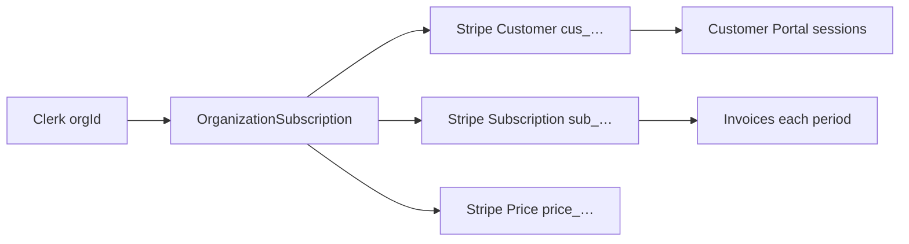
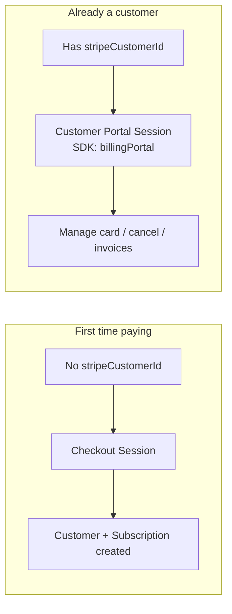
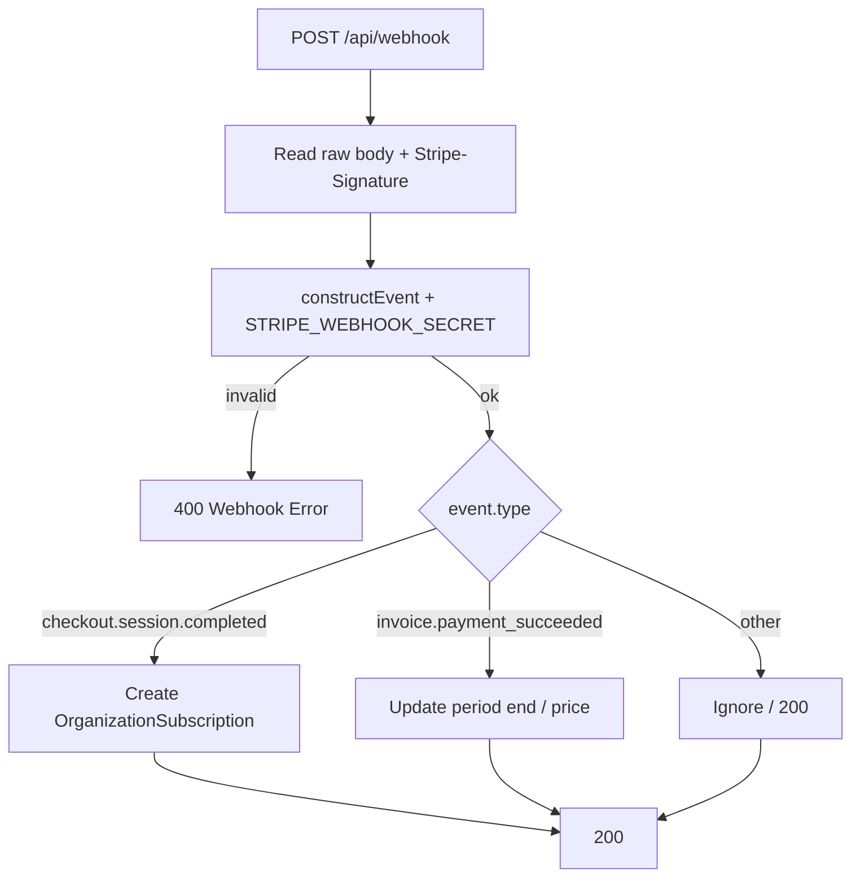
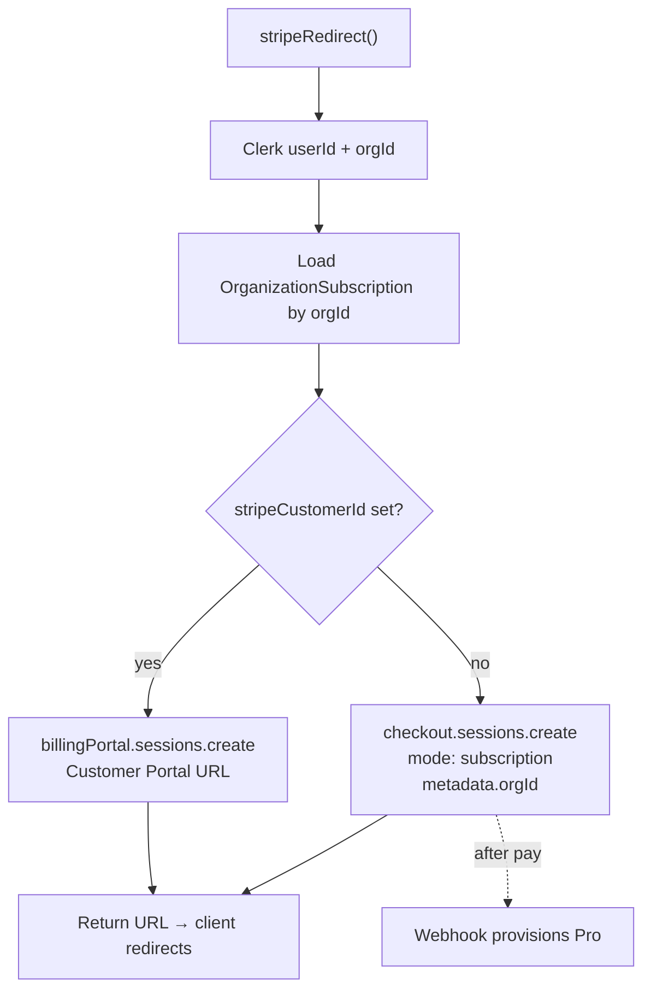
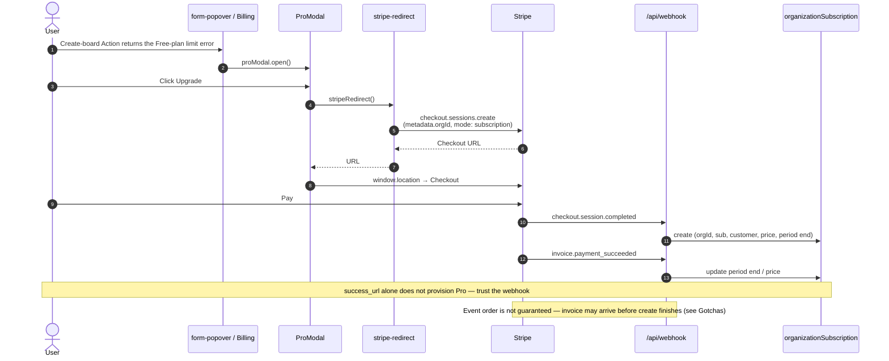
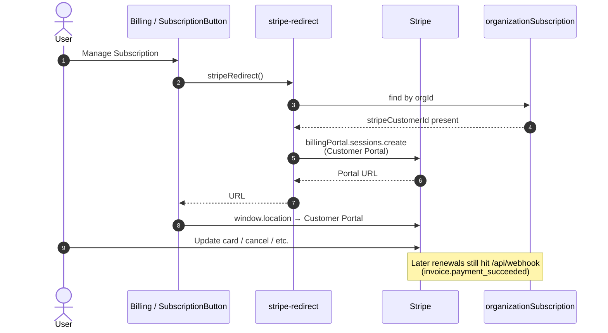
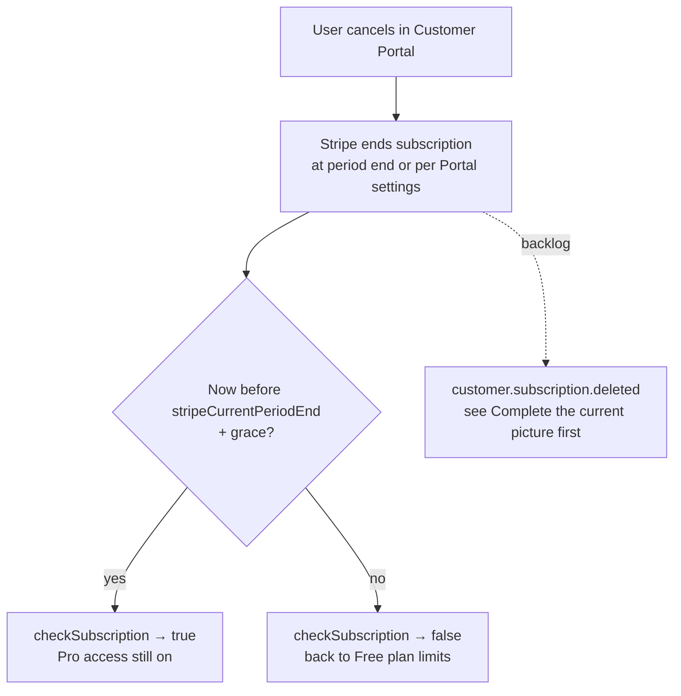

# Billing

How **billing** works for the **Pro** pricing plan. **Stripe** is the current **billing provider** (swappable later). Inline comments explain _why_ a line exists; this page is the bird’s-eye view. Update diagrams when user-visible flows change.

|                 |                                                                                                            |
| --------------- | ---------------------------------------------------------------------------------------------------------- |
| **Owner / SoT** | This file — Checkout / Portal / webhooks / `checkSubscription` map, hardening backlog, growth doors        |
| **Open when**   | Stripe Checkout, Customer Portal, webhooks, Pro gating, pricing-plan entitlements, or monetization backlog |

Index: [`README.md`](./README.md). Terms: [`vocabulary.md`](./vocabulary.md). Pricing numbers: [`constants/pricing-plans.ts`](../constants/pricing-plans.ts). Provider _why_: [`product.md`](./product.md). **Official Stripe** for the installed `stripe` SDK **and** Dashboard API version — [`conventions.md` → Match installed](./conventions.md#match-installed-official-docs) (Stripe · dinero.js rows). Entry points: [Checkout](https://docs.stripe.com/payments/checkout) · [Customer Portal](https://docs.stripe.com/customer-management) · [Webhooks](https://docs.stripe.com/webhooks) · [Subscription webhooks](https://docs.stripe.com/billing/subscriptions/webhooks). This file is **our** Checkout / Portal / webhook / `checkSubscription` map and backlog — not a Stripe docs mirror.

**Page shape:** Already following → TODO (harden) → Out of scope (growth) → deep detail (concepts, flows, file map).

## Already following (keep as examples)

- **Happy path** — Checkout → webhook create → renewals update → Customer Portal → `checkSubscription` gates Pro ([Happy path](#happy-path--first-upgrade), [Returning customer](#returning-customer--manage-billing))
- **Tenant link** — Checkout `metadata.orgId` (Clerk) ↔ `OrganizationSubscription` ↔ Stripe Customer / Subscription / Price
- **UI entry** — organization billing page + Pro modal; Server Action `stripe-redirect`; webhook at `/api/webhook`
- **Create vs Pro** — navbar + tile always open the create form; the Action is the Free cap; the limit error opens Pro ([Create does not gate on click](#create-does-not-gate-on-click))
- **Plan constants** — Free / Pro in [`constants/pricing-plans.ts`](../constants/pricing-plans.ts)

Do **not** add a parallel billing stack without an explicit product decision — finish the hardening backlog first.

## TODO — complete the current picture first

Hardiness, lifecycle fidelity, and small UX polish — **not** missing Checkout/Portal wiring. Full P0 / P1 / P2 tables live under [Complete the current picture first](#complete-the-current-picture-first). Do that backlog **before** [Opening more doors](#opening-more-doors-growth-paths).

## Out of scope for now (growth / later)

Multi-plan, annual, trials, seats, usage billing, embedded Checkout, tax, etc. — see [Opening more doors](#opening-more-doors-growth-paths). Switching providers is a product decision ([`product.md`](./product.md)).

## Why Stripe (for now)

**Stripe** is the current **billing provider** (easy Checkout / Portal / webhooks path). Product _why_, regional limits, and multi-provider direction live in [`product.md`](./product.md) (**Billing vs billing provider**). This file is the integration, flows, and backlog.

Read **Stripe concepts** below before diving into Stripe’s own docs — it maps their vocabulary onto what this project actually does.

## Stripe concepts (read this first)

### The cast of objects

Stripe is a ledger of objects. This app only uses a few:

| Stripe object               | Plain English                                                          | In this project                                                      |
| --------------------------- | ---------------------------------------------------------------------- | -------------------------------------------------------------------- |
| **Customer**                | Who pays (`cus_…`)                                                     | Saved as `stripeCustomerId` so we can open the Customer Portal later |
| **Product**                 | What you sell (Checkout product name = `PRO_PLAN.name`)                | Created inline via Checkout `price_data.product_data` (demo style)   |
| **Price**                   | How you charge for it ($20 / month)                                    | Dinero → `unit_amount`; id stored as `stripePriceId`                 |
| **Subscription**            | Ongoing agreement to bill on a schedule (`sub_…`)                      | Saved as `stripeSubscriptionId`; renewals look this up               |
| **Invoice**                 | A bill for a period (first charge or renewal)                          | Webhook listens for successful payment                               |
| **Checkout Session**        | One hosted **pay / subscribe** page                                    | Created when the organization has **no** Stripe customer yet         |
| **Customer Portal Session** | Hosted **manage subscription** page (same product as “Billing Portal”) | Created when the organization **already** has a `stripeCustomerId`   |

Clerk’s `orgId` is _our_ tenant id. Stripe never knows about Clerk unless we put
`orgId` in Checkout `metadata` so the webhook can link them.

How objects connect after a successful first Checkout:



### Vocabulary: page, portal, session

**Page (everyday English)** — any web screen the user sees. Your Next.js routes
(`/organization/.../billing`) are _your_ pages. Stripe also hosts pages
(Checkout pay UI, Customer Portal manage UI).

**Portal (Stripe product name)** — specifically the **Customer Portal** (SDK:
`billingPortal`): a multi-purpose Stripe-hosted area for _existing_ customers to
self-serve billing. “Portal” here is branding for that manage product — not a
generic word for “any Stripe page.”

So:

| Phrase                        | Means                                                                 |
| ----------------------------- | --------------------------------------------------------------------- |
| Checkout **page**             | The pay/subscribe UI Stripe shows for a Checkout Session              |
| Customer / Billing **Portal** | The manage-subscription product (and its UI)                          |
| Your billing **page**         | This app’s `/billing` route (buttons that _start_ Checkout or Portal) |

**Session** — a **short-lived API object** your server creates that represents
“this user may use that hosted UI **once / for a short time**.” Creating a
session returns a URL; you redirect the browser there.

| Session type                | Creates                         | Returns             |
| --------------------------- | ------------------------------- | ------------------- |
| **Checkout Session**        | `checkout.sessions.create`      | Pay URL (`cs_…` id) |
| **Customer Portal Session** | `billingPortal.sessions.create` | Manage URL          |

Sessions are **ephemeral** (Portal sessions expire quickly if unused). The lasting
objects are Customer, Subscription, Invoice, etc. Think:

```text
Session  = temporary ticket + URL to a hosted UI
Portal   = the “manage billing” product (one kind of hosted UI)
Page     = whatever HTML the user is looking at (yours or Stripe’s)
```

### Checkout vs Customer Portal (aka Billing Portal)

**Naming trap:** Stripe’s docs say **Customer Portal**. The Node SDK method is
`stripe.billingPortal.sessions.create`. Those are the **same product** — one
hosted “manage my subscription” UI, not two portals.

This app only uses **two** Stripe-hosted pages:

| Hosted UI                              | Job                                 | API                             |
| -------------------------------------- | ----------------------------------- | ------------------------------- |
| **Checkout**                           | First-time pay / start subscription | `checkout.sessions.create`      |
| **Customer Portal** (= Billing Portal) | Manage card, cancel, invoices, plan | `billingPortal.sessions.create` |

Checkout is **not** a portal. Ignore other Stripe “dashboards” (e.g. Connect
Express) — unused here.



In code (`actions/stripe-redirect`):

- **No** `stripeCustomerId` → `checkout.sessions.create` (start **Pro**)
- **Has** `stripeCustomerId` → `billingPortal.sessions.create` (Customer Portal / manage **Pro**)

You do **not** build card forms yourself in this project. After redirect back to
`success_url` / `return_url`, the user is home — but **Pro access is not granted by
that redirect**. Stripe notifies us via **webhooks**; `app/api/webhook` writes
`OrganizationSubscription`; `checkSubscription` reads it.

### Checkout `mode` (what kind of purchase)

When creating a Checkout Session you must set `mode`:

| `mode`             | Meaning                                                        | Recurring? | Used here?                        |
| ------------------ | -------------------------------------------------------------- | ---------- | --------------------------------- |
| **`subscription`** | Start a Subscription; Stripe invoices now and on each interval | Yes        | **Yes** — Pro                     |
| **`payment`**      | One-time charge (buy once)                                     | No         | No — would be e.g. a one-off pack |
| **`setup`**        | Save a payment method **without** charging yet                 | No         | No — e.g. collect card for later  |

This app uses only `mode: "subscription"` because **Pro** is monthly plan access, not a
one-time fee.

Related ideas you will see in Stripe docs (not separate Checkout modes):

- **PaymentIntent** — lower-level “charge this amount once” API. Checkout in
  `payment` mode uses this under the hood. We don’t call it directly.
- **SetupIntent** — save a card without charging. Checkout `setup` mode uses this.
- **Invoice** — for subscriptions, Stripe creates invoices automatically each period.

### Money amounts

Stripe `unit_amount` is always an **integer in the smallest currency unit**
(cents for USD): `2000` = $20.00. Currency codes in the API are **lowercase**
(`usd`). We build amounts with Dinero.js and map them via `toStripeUnitAmount` /
`toStripeCurrency` in `lib/stripe.ts`.

### Webhooks in one sentence

Your server exposes `POST /api/webhook`. Stripe signs each event; we verify the
signature, then:

1. `checkout.session.completed` → **create** our DB row (organization ↔ Stripe ids)
2. `invoice.payment_succeeded` → **update** period end / price (renewals; also fires on first invoice)

Until (1) succeeds, `checkSubscription` stays false even if Checkout looked successful.

**Security (don’t skip):** use the **raw** request body (`req.text()`), never
`req.json()` first. Verify `Stripe-Signature` with `constructEvent` and
`STRIPE_WEBHOOK_SECRET`. Without verification, anyone could POST a fake
“payment succeeded” and unlock **Pro**.

**Secrets:** the `whsec_…` from `stripe listen` (local) is **not** the same as the
secret on a Dashboard webhook endpoint (deployed). Use the secret that matches
how events are delivered.

**Retries:** Stripe retries on 4xx/5xx. Prefer fast 2xx when you’ve handled (or
intentionally ignored) an event. See also the first-payment race note under
Gotchas.

**`invoice.payment_succeeded` vs `invoice.paid`:** Stripe docs sometimes prefer
`invoice.paid` for provisioning. This project uses `invoice.payment_succeeded`
(common in tutorials). Both relate to a successful invoice payment — pick one
model and stay consistent if you change it.



### Mental model for `stripe-redirect`



## Happy path — first upgrade

Entry points: create-board **limit error** from `FormPopover` (navbar Create or the org
tile) or Billing page **Upgrade to Pro** (`SubscriptionButton` → Pro modal).



## Returning customer — manage billing

Organizations on **Pro** use the Billing page and call `stripeRedirect` **directly** (no Pro modal) →
Customer Portal (SDK: `billingPortal` — same product).



## Component map

Paths change — treat this as a starting index, not a contract. Prefer searching
the repo (`checkSubscription`, `stripeRedirect`, `organizationSubscription`) when
in doubt.

| Piece                   | Path                                                                                         | Role                                                                                                                                                                                                                                                                                                     |
| ----------------------- | -------------------------------------------------------------------------------------------- | -------------------------------------------------------------------------------------------------------------------------------------------------------------------------------------------------------------------------------------------------------------------------------------------------------- |
| Free-plan limit trigger | `components/form/form-popover.tsx` · `board-list/create-board-tile.tsx` · `dashboard-navbar` | Create always opens the form; the Action enforces the cap; the limit error opens Pro. Remaining copy + `?` Hint are tile-only (navbar is Create / plus). Why no click gate: [Create does not gate on click](#create-does-not-gate-on-click). Tile remaining is Playwright — [`testing.md`](./testing.md) |
| Billing page            | `organization/[organizationId]/billing/`                                                     | Shows plan via `Info` + `SubscriptionButton`                                                                                                                                                                                                                                                             |
| Subscription CTA        | `billing/_components/subscription-button.tsx`                                                | **Free** plan → Pro modal; **Pro** → Customer Portal (`billingPortal`)                                                                                                                                                                                                                                   |
| Modal store             | `stores/use-pro-modal-store.ts`                                                              | Client open/close state                                                                                                                                                                                                                                                                                  |
| Upgrade UI              | `components/modals/pro-modal.tsx`                                                            | Calls `stripeRedirect`, navigates to Stripe URL                                                                                                                                                                                                                                                          |
| Server action           | `actions/stripe-redirect/index.ts`                                                           | Checkout (new) or Customer Portal / billingPortal (existing)                                                                                                                                                                                                                                             |
| Stripe client           | `lib/stripe.ts`                                                                              | SDK instance + `stripeTimestampToDate`                                                                                                                                                                                                                                                                   |
| Webhook                 | `app/api/webhook/route.ts`                                                                   | Verifies signature; creates/updates DB row                                                                                                                                                                                                                                                               |
| Authentication gate     | `proxy.ts`                                                                                   | `/api/webhook` is public (Stripe has no Clerk session)                                                                                                                                                                                                                                                   |
| Plan access check       | `lib/subscription.ts`                                                                        | `checkSubscription` (RSC, React `cache`) / `isProOrganization` (Actions, pass `tx`) — billing UI, board limits. Mutations re-read Pro inside `$transaction`. [`data.md`](./data.md)                                                                                                                      |
| Persistence             | `prisma/schema.prisma` → `OrganizationSubscription`                                          | Links Clerk `orgId` ↔ Stripe IDs                                                                                                                                                                                                                                                                         |

## Data we store

Webhook writes / updates `OrganizationSubscription` (see field-level **why** comments in
`prisma/schema.prisma`). Short summary:

- `orgId` — Clerk organization id (`orgId` from Clerk); from Checkout `metadata` (set in `stripe-redirect`)
- `stripeCustomerId` — open Customer Portal later (`billingPortal.sessions`)
- `stripeSubscriptionId` — renewal webhook lookups (invoices have no organization metadata)
- `stripePriceId` / `stripeCurrentPeriodEnd` — which plan is active and until when (`checkSubscription`)

App-side money (Checkout `unit_amount`) uses [Dinero.js](https://dinerojs.com) —
integer minor units + currency (`PRO_PLAN.priceMonthly` in `constants/pricing-plans.ts` →
`toStripeUnitAmount` / `toStripeCurrency` in `lib/stripe.ts`). Format for display with
`Intl.NumberFormat` via Dinero’s `toDecimal` transformer when needed.

## Local webhook testing

```bash
stripe listen --forward-to localhost:3000/api/webhook
```

Put the printed `whsec_...` into `STRIPE_WEBHOOK_SECRET` (CLI secret ≠ Dashboard endpoint secret).

## Gotchas in this project

### Create does not gate on click

Navbar Create and the org create-tile always open [`FormPopover`](../components/form/form-popover.tsx). There is no “at cap → Pro modal” branch on click.

The Free cap is the create-board Action (`isProOrganization` + slot reserve inside `$transaction`). On the limit error, `FormPopover` toasts, closes, and opens the Pro modal.

That is the Create instance of the repo rule: **UI may be stale; writes re-check** — [`data.md`](./data.md). At the cap, the user can fill the form and only then see Pro. We do not pre-check access in the UI (RSC render or a click-time Server Function). Those guesses went stale in the dashboard **layout** navbar — it survives org switches and board navigation — and opened Pro when create would still succeed (or the reverse).

Navbar is only Create / plus — no remaining count, no `?` Hint. The org tile shows remaining copy and the Hint (Hint still describes the Free cap when Pro — P2 below).

### `isPro` vs `stripeCustomerId` (not the same)

| Check                             | Where                                                                   | Means                                                                                                                                  |
| --------------------------------- | ----------------------------------------------------------------------- | -------------------------------------------------------------------------------------------------------------------------------------- |
| **`isPro`** (`checkSubscription`) | UI (Billing button label, tile remaining / Unlimited, Free / Pro badge) | “Does this organization have **Pro** access right now?” — needs `stripePriceId` + `stripeCurrentPeriodEnd` still valid (+ 1-day grace) |
| **`stripeCustomerId`**            | `stripe-redirect` branch                                                | “Do we already have a Stripe Customer so we open **Customer Portal** instead of Checkout?”                                             |

Usually they agree after a successful Checkout + webhook. They can diverge briefly
(webhook lag) or if you later add free trials, past-due grace, etc. Don’t replace
one with the other without thinking.

### Cancel / when Pro access actually ends

Today users can cancel in the **Customer Portal**. We do **not** yet handle
`customer.subscription.deleted` (or similar) in the webhook.

Access is gated by **`stripeCurrentPeriodEnd`** in `checkSubscription`: after
cancel, Stripe typically lets the period finish, so **Pro** can remain until that
timestamp (plus grace). Instant lockout on cancel would need extra webhook
handling + product decision.



### First-payment race

`invoice.payment_succeeded` can arrive **before** `checkout.session.completed`
finishes creating `organizationSubscription`. The renew `update` then fails until
Stripe retries. Prioritized under **Complete the current picture first**; TODO in
`app/api/webhook/route.ts`. Hardening ideas: ignore not-found, upsert, or only
update when `billing_reason` is a renewal.

### Inline `price_data` vs Dashboard Prices

Checkout currently builds Product/Price **inline** (`price_data` in
`stripe-redirect`) — fine for demos. Production SaaS usually creates Products/Prices
in the [Stripe Dashboard](https://dashboard.stripe.com/products) (or API once) and
passes `price: "price_…"`. That unlocks cleaner Portal plan-switching, coupons,
and multiple tiers without redeploying amount constants.

### Test mode vs live mode

|           | Test                                                                | Live                      |
| --------- | ------------------------------------------------------------------- | ------------------------- |
| Keys      | `sk_test_…` / `pk_test_…`                                           | `sk_live_…` / `pk_live_…` |
| Dashboard | Test mode toggle                                                    | Live mode                 |
| Cards     | [Test card numbers](https://docs.stripe.com/testing) (e.g. `4242…`) | Real cards                |
| Money     | No real charges                                                     | Real charges              |

Never mix test webhook secrets with live keys. Local `stripe listen` is almost
always against **test** mode.

## Complete the current picture first

The **happy path is done**: Checkout → webhook create → renewals update → Customer
Portal manage → `checkSubscription` gates features. Cancel eventually works via
**period end** even without a delete webhook.

What follows is **not** missing Checkout/Portal wiring — it is hardiness, lifecycle
fidelity, and small UX polish. **Do this backlog before Opening more doors.**

### P0 — harden / make reliable

| Item                    | Why                                                                                                                                                      | Where                                                 |
| ----------------------- | -------------------------------------------------------------------------------------------------------------------------------------------------------- | ----------------------------------------------------- |
| **First-payment race**  | `invoice.payment_succeeded` can arrive before `checkout.session.completed` creates the row → update fails → Stripe retries (often recovers, still flaky) | `app/api/webhook/route.ts`                            |
| **Log errors**          | Catch blocks return generic `"Something went wrong"` / `"Webhook Error"` and discard the real Stripe/Prisma error — hard to debug                        | `actions/stripe-redirect`, `app/api/webhook`          |
| **Webhook idempotency** | Replayed `checkout.session.completed` can try to **create** again and blow up on unique `orgId`                                                          | `app/api/webhook/route.ts` + Prisma unique on `orgId` |

### P1 — subscription lifecycle fidelity

| Item                                            | Why                                                                                                   | Notes                                                                                |
| ----------------------------------------------- | ----------------------------------------------------------------------------------------------------- | ------------------------------------------------------------------------------------ |
| **`invoice.payment_failed`** (or past-due)      | Failed renewals leave the organization looking like **Pro** until period end with no status sync / UX | Also overlaps dunning in growth table — handle the event here first                  |
| **`customer.subscription.updated` / `deleted`** | Cancel-at-period-end, plan changes, immediate cancel aren’t mirrored beyond renewals + period end     | Instant lockout on cancel is a **product** decision; period-end gating already works |

### P2 — polish (same integration, not new doors)

| Item                                  | Why                                                                             | Where                              |
| ------------------------------------- | ------------------------------------------------------------------------------- | ---------------------------------- |
| Board-list Hint                       | Still describes the Free-plan 5-board limit when the organization is on **Pro** | `board-list/create-board-tile.tsx` |
| Omit `payment_method_types: ["card"]` | Stripe prefers unset so Dashboard dynamic methods apply                         | `actions/stripe-redirect`          |
| Pro modal external redirect           | Confirm Next.js-friendly navigation to Stripe URLs                              | `components/modals/pro-modal.tsx`  |
| Unused action `data`                  | Empty schema today; prefix `_` or use when Checkout needs input                 | `actions/stripe-redirect`          |

**Out of scope for this backlog** (growth / later): multi-plan, annual, trials, tax,
seats, usage billing, embedded Checkout — see **Opening more doors**. Switching
inline `price_data` → Dashboard `price_…` is optional hardening that also unlocks
growth; prefer it when leaving the single-price demo, not as a blocker for P0/P1.

## Opening more doors (growth paths)

> **Do not start here.** Finish **Complete the current picture first** (P0 → P1 →
> P2) before picking a growth door below.

What we ship today is **billing** for a **single monthly Pro** subscription via Checkout + Portal +
webhooks (plus the default **Free** plan). That’s a solid base — not a ceiling. Natural next monetization and
product moves (each opens Stripe/docs doors):

| Direction                                               | Why it makes money / improves UX           | Stripe / product hooks                                                                                                                                                                              |
| ------------------------------------------------------- | ------------------------------------------ | --------------------------------------------------------------------------------------------------------------------------------------------------------------------------------------------------- |
| **Multiple paid plans** (e.g. Starter / Pro / Business) | Price discrimination; upsell               | Extend [`constants/pricing-plans.ts`](../constants/pricing-plans.ts) (new `*Plan` type + `PLANS` entry — see file header); Dashboard Prices + Portal plan switching; store which `price_` is active |
| **Annual billing**                                      | Higher commitment, often higher LTV        | Second Price on the same Product (`interval: year`)                                                                                                                                                 |
| **Trials**                                              | Lower signup friction → more conversions   | `subscription_data.trial_period_days` on Checkout; handle trial-end events                                                                                                                          |
| **One-time packs**                                      | Add-ons without a subscription             | Checkout `mode: "payment"` (credits, lifetime unlock, etc.)                                                                                                                                         |
| **Per-seat / per-member pricing**                       | Grows with organization size               | Quantity on subscription items; sync with Clerk organization membership                                                                                                                             |
| **Usage-based** (API calls, AI tokens, storage)         | Align price with value                     | [Metronome](https://docs.stripe.com/billing/usage-based) / meters — not required for simple **Pro**                                                                                                 |
| **Coupons & promotion codes**                           | Campaigns, win-back, influencer deals      | Checkout `allow_promotion_codes` / Coupons API; Portal retention offers                                                                                                                             |
| **Embedded Checkout / Payment Element**                 | Stay on-site, higher control/branding      | Still Checkout Sessions under the hood; more frontend work                                                                                                                                          |
| **Customer emails & dunning**                           | Recover failed renewals                    | Stripe Billing automations + richer failed-pay UX (after P1 `invoice.payment_failed`)                                                                                                               |
| **Tax (VAT/GST)**                                       | Compliance in more countries               | Stripe Tax + registrations — enable carefully                                                                                                                                                       |
| **Customer Portal deep links**                          | One-click “update card” from emails        | Portal configuration + session deep links                                                                                                                                                           |
| **Entitlements / feature flags by plan**                | Sell features, not just “unlimited boards” | Map `stripePriceId` (or product metadata) → feature gates beyond board limits                                                                                                                       |

When you add a door, update this doc’s diagrams and the webhook event list — and
prefer **Dashboard Price ids** once you leave the single inline `price_data` demo.

## Older Stripe API notes

Tutorial / API-version diffs (2023-10-16 → later Invoice/Subscription shape) are a
**frozen archive** at the bottom of `app/api/webhook/route.ts`. Live handler code
above that block is the source of truth — don’t expect the archive to track every
Stripe version bump.
