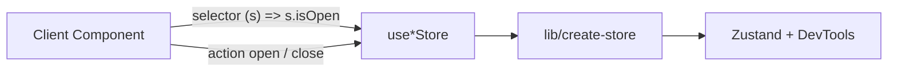

# Client UI state

Ephemeral **browser UI state** shared across components — modals open/closed, which card id is selected, mobile sidebar, etc.

|                 |                                                                                       |
| --------------- | ------------------------------------------------------------------------------------- |
| **Owner / SoT** | This file — when to use a client store, mental model, repo patterns (Zustand today)   |
| **Open when**   | Adding shared client UI state, debugging a store, or onboarding to how we use Zustand |

**Implementation today:** [Zustand](https://zustand.docs.pmnd.rs). Catalog picks: [`conventions.md`](./conventions.md). Index: [`README.md`](./README.md).

**Do not** put server/domain data here (boards, cards, billing). That stays Prisma / Server Actions / TanStack Query — [`data.md`](./data.md).

Official Zustand docs cover the API well but say little about _how we compose it with React naming, Next.js, and this repo’s factory_. This page is that missing layer.

## Already following

- **Multiple small stores** — one file per concern under `stores/use-*-store.ts` (not one global store)
- Domain/event action names (`open`, `close`) — not React `on*` / `handle*` on the store
- Slice selectors at every call site (no bare `useXStore()`)
- One factory [`lib/create-store.ts`](../lib/create-store.ts) (sole `zustand` import; wires `devtools`)
- React UI boundary keeps `on*` props and `handle*` locals — see [React vs store naming](#react-vs-store-naming)

## TODO

- [ ] **Zustand slices** (compose parts into _one_ store) only if a single store file grows huge and must stay one store — see [Stores vs slices](#stores-vs-slices-not-redux-default)
- [ ] Nested `actions: { … }` only if TkDodo’s split helps a large store ([Working with Zustand](https://tkdodo.eu/blog/working-with-zustand))
- [ ] `shallow` / multi-field object selectors only when selecting objects that would break referential equality

## Out of scope for now

- Redux, Jotai, or a second global-state library beside Zustand
- One Redux-style “app store” that holds all client UI state (we use many small stores instead)
- React Context as a store for ephemeral UI flags (see [One tool per job](#one-tool-per-job-zustand--context) — Providers today are Query / Clerk / theme injection, not UI flags)
- Persisting UI stores to `localStorage` / session (Zustand `persist`) until product needs it
- Moving server cache into Zustand (use Query / RSC instead)

## Mental model

```text
Zustand store  =  client UI memory + named events
Selector       =  “I only care about this piece”
createStore    =  our create + devtools wrapper
open / close   =  store language (domain verbs)
handleOpen     =  React language at the button / Dialog
```

**How to read the arrows** (same convention as [`data.md`](./data.md)): each arrow is a **call**, not “owns.”



## When to use a client store

| Use Zustand                                           | Do not use Zustand                                |
| ----------------------------------------------------- | ------------------------------------------------- |
| Modal / sheet open state shared by distant components | Form field values (keep in the form / `useState`) |
| “Which card id is the modal about?”                   | Boards, lists, cards from the DB                  |
| Mobile sidebar open/close                             | Auth session (Clerk)                              |
| Other ephemeral UI flags that several trees need      | Server Action results (Query / RSC / `useAction`) |

If only **one** component tree needs the flag, prefer local `useState`. Reach for a store when several distant trees need the same flag (not when you’d invent a Context for that flag).

## Stores vs slices (not Redux default)

Contributors from Redux often assume **one app store** and **slices** as pieces of that store. Zustand allows that pattern, but **this repo does not use it**.

|                                           | **Redux (typical)**                          | **This repo (Zustand)**                                                                     |
| ----------------------------------------- | -------------------------------------------- | ------------------------------------------------------------------------------------------- |
| How many stores?                          | One global store                             | **Many** small stores                                                                       |
| What is a “slice”?                        | Official RTK unit merged into that one store | Optional pattern: functions merged into _one_ `create` when a _single_ store file gets huge |
| What is `stores/use-card-modal-store.ts`? | Would be odd as a separate Redux store       | A **full store** (not a slice)                                                              |
| New shared UI flag?                       | Usually another slice on the same store      | Usually another **`stores/use-*-store.ts`**                                                 |

**Default here:** one concern → one store file → `use*Store`. Card modal, Pro modal, and mobile sidebar are three stores on purpose.

**When (if ever) to use Zustand slices:** only if you deliberately keep **one** store and it becomes too large to maintain in one file — then split with slice functions and compose them in `create` ([TkDodo](https://tkdodo.eu/blog/working-with-zustand)). Do **not** rename our small stores “slices” or merge unrelated UI into one mega-store “because Redux has one store.”

**Slice selectors** (`useXStore((s) => s.isOpen)`) are unrelated naming: that means “select a piece of state,” not Redux Toolkit’s `createSlice`.

## One tool per job (Zustand ≠ Context)

Do **not** treat Context and Zustand as interchangeable “shared state” options. Pick by **job**, then stick to that tool every time that job shows up.

### In this repo today

| Job                                                         | Tool                              | Where                                                                         |
| ----------------------------------------------------------- | --------------------------------- | ----------------------------------------------------------------------------- |
| Shared ephemeral UI (modal open, sidebar, selected card id) | **Zustand**                       | `stores/use-*-store.ts`                                                       |
| Local / single-subtree UI                                   | **`useState`**                    | e.g. form fields; `ModalProvider` mount gate                                  |
| Query client for the tree                                   | **TanStack `QueryProvider`**      | `providers/query-provider.tsx`                                                |
| Auth SDK for the tree                                       | **Clerk provider**                | `providers/clerk-provider.tsx`                                                |
| Theme for the tree                                          | **`ThemeProvider`** (next-themes) | `providers/theme-provider.tsx`                                                |
| Mount card/pro modals once (hydration)                      | **`ModalProvider`**               | `providers/modal-provider.tsx` — **not** Context state; open/close is Zustand |
| Server / domain data                                        | Prisma / Actions / Query          | [`data.md`](./data.md)                                                        |

**Rule:** app UI memory that changes and many components subscribe to → Zustand. “Here is the client/SDK/config for this subtree” → that library’s Provider. Never both for the same concern.

### Same rule later

If we add another **injection** job (e.g. i18n), use that library’s Provider — not Zustand. If we add another **shared UI flag**, use a Zustand store in `stores/` — not a new Context. Don’t add Redux/Jotai for either job.

**Anti-patterns**

- `CardModalContext` for `isOpen` / `id` while `useCardModalStore` exists (or instead of it)
- Putting Query/Clerk/theme clients into Zustand “so we only have one library”
- Using Context for a new sidebar/modal flag “because providers already exist”

## Ground up (Zustand → this repo)

### 1. Smallest store

```ts
import { create } from "zustand";

type BearStore = {
  bears: number;
  increase: () => void;
};

export const useBearStore = create<BearStore>((set) => ({
  bears: 0,
  increase: () => set((state) => ({ bears: state.bears + 1 })),
}));
```

| Piece                | Meaning                                         |
| -------------------- | ----------------------------------------------- |
| `create(...)`        | Builds a store; returns a **React hook**        |
| `(set) => ({ ... })` | Initial **state** + **actions** that call `set` |
| `set(...)`           | Shallow-merge updates into the store            |

In this app we **do not** call `create` in store files — we call [`createStore`](../lib/create-store.ts) (below).

### 2. State vs actions

```ts
type CardModalStore = {
  id?: string; // state
  isOpen: boolean; // state
  open: (id: string) => void; // action
  close: () => void; // action
};
```

- **State** — what is true right now
- **Actions** — what events can happen (`open`, `close`)

Prefer **event / domain verbs** on the store ([TkDodo: actions as events](https://tkdodo.eu/blog/working-with-zustand)), not `setIsOpen` as the primary API, and not React’s `onOpen` / `handleOpen` as store keys.

### 3. Slice selectors

```ts
// Re-renders when anything in the store changes
const store = useCardModalStore();

// Re-renders only when isOpen changes
const isOpen = useCardModalStore((s) => s.isOpen);
const close = useCardModalStore((s) => s.close);
```

The function `(s) => s.isOpen` is a **slice selector**. This repo always passes one (ESLint bans bare `useXStore()`). Quality of the selector (e.g. avoiding `(s) => s`) is still a judgment call.

### 4. React vs store naming

Two languages at the boundary:

| Layer                         | Names        | Example                     |
| ----------------------------- | ------------ | --------------------------- |
| Store                         | domain verbs | `open`, `close`             |
| React props                   | `on*`        | `onClick`, `onOpenChange`   |
| React locals used as handlers | `handle*`    | `handleOpen`, `handleClose` |

```ts
const handleOpen = useCardModalStore((s) => s.open);
// …
onClick={() => handleOpen(cardId)}
```

Do **not** put `on*` / `handle*` on the store type. ESLint bans those keys in `stores/**/*-store.ts`.

### 5. Repo factory: `createStore`

[`lib/create-store.ts`](../lib/create-store.ts) is the **only** module allowed to import `zustand` / `zustand/*`. It combines:

- Curried `create<T>()(…)` for TypeScript inference (see below)
- [`devtools`](https://zustand.docs.pmnd.rs/middlewares/devtools) (dev-only)
- DevTools instance `name` derived from the **store file** (`use-card-modal-store.ts` → `CardModalStore`) via the call stack — no extra string and no second `useCardModalStore` in the file

**Curried `create`:** In functional programming, **currying** means turning a multi-argument function into a chain of single-argument calls — `f(a, b)` becomes `f(a)(b)`. Zustand’s docs use that idea loosely: you call `create` **twice** instead of once.

```ts
// One shot — often fine for a plain store
create<BearStore>((set) => ({ … }))

// Two shots — what Zustand recommends with middleware / explicit T
create<BearStore>()(devtools((set) => ({ … }), { name: "BearStore" }))
//              ^^ empty call returns a function; then you pass the initializer
```

The empty `()` is mostly a **TypeScript inference trick**, not a deep FP requirement. With middleware, TS has a hard time inferring the store type and the middleware’s typed `set` in a single `create(…)` call. Specifying `T` on the first call, then passing the middleware-wrapped initializer on the second, makes `set`, actions, and DevTools labels type-check. [`createStore`](../lib/create-store.ts) hides that: you write `createStore<CardModalStore>(…)` and it does `create<T>()(devtools(…))` inside.

**Zustand middleware** (do not confuse with Next.js `middleware.ts` / `proxy.ts` or Express/Koa request middleware).

If you come from backend middleware, think **function composition / onion nesting**, not “run once before the handler, then once after.” Your store body is still `(set) => ({ … })`. Middleware is an **outer function** that takes that body and returns a new body for `create`:

```text
create(
  devtools(          ← outer: middleware
    (set) => ({ … }) ← inner: your state + actions
  )
)
```

Same idea as `create(devtools(persist(initializer)))` — each layer sits **around** the next.

What that means in practice:

1. **At store creation** — the outer layer runs first, then calls your initializer (and may do setup, e.g. `persist` reading `localStorage`).
2. **For the life of the store** — the outer layer usually **intercepts `set` / `get`**. When an action calls `set`, the update still happens; middleware adds side effects around that call (e.g. `devtools` pushes the labeled action to Redux DevTools; `persist` writes storage).

So it is **around** the initializer and **around** later updates — not a separate “before middleware → store → after middleware” pipeline like HTTP.

We only wire `devtools` today, and only through `createStore`. `persist` is out of scope until we need it.

A store file looks like:

```ts
import { createStore } from "@/lib/create-store";

type CardModalStore = {
  id?: string;
  isOpen: boolean;
  open: (id: string) => void;
  close: () => void;
};

export const useCardModalStore = createStore<CardModalStore>((set) => ({
  id: undefined,
  isOpen: false,
  open: (id) => set({ id, isOpen: true }, false, "open"),
  close: () => set({ id: undefined, isOpen: false }, false, "close"),
}));
```

| `set` argument | Meaning                                |
| -------------- | -------------------------------------- |
| 1st            | Partial state to merge                 |
| 2nd `false`    | Merge (do not replace the whole store) |
| 3rd `"open"`   | Action label in Redux DevTools         |

**DevTools naming:** The file path is the source of truth (`stores/use-*-store.ts`). At create time (dev only), `createStore` reads the call stack, finds that file, and maps `use-card-modal-store` → `CardModalStore`. You do **not** pass a name, `import.meta.url`, or a second `useCardModalStore` function name — those were either a third identity or awkward duplication. If the stack parse fails, you’ll get a console warning; keep stores in `stores/use-*-store.ts`.

### 6. File and export conventions

| Piece         | Pattern                 | Example                   |
| ------------- | ----------------------- | ------------------------- |
| File          | `stores/use-*-store.ts` | `use-card-modal-store.ts` |
| Export        | `use*Store`             | `useCardModalStore`       |
| DevTools name | Derived from file       | `CardModalStore`          |

File kebab-case and export camelCase must describe the **same** name (`use-card-modal-store` ↔ `useCardModalStore`). ESLint enforces that via `filename-match-export` (and: direct `zustand` import only in `lib/create-store.ts`; store exports must match `use*Store`; no bare `use*Store()`; no `on*`/`handle*` store keys).

### 7. DevTools

1. Install the [Redux DevTools](https://github.com/reduxjs/redux-devtools) browser extension
2. Run the app in development
3. Open the extension → pick instances like `CardModalStore` (from the file name)
4. Trigger UI → inspect actions (`open` / `close`) and state diffs

## Example flow (card modal)

```text
User clicks a card
  → CardItem: handleOpen(id)          // React handler
  → useCardModalStore.open(id)        // Zustand action
  → { id, isOpen: true }

CardModal reads selectors
  → isOpen, id
  → Dialog open with that card

After delete succeeds
  → close()
  → isOpen: false
```

Server work (fetch card, delete card) stays in Route Handlers / Server Actions / Query. The store only tracks **UI**: open or not, and which id.

## Adding a new store

1. Add `stores/use-foo-store.ts`
2. `createStore<FooStore>((set) => ({ … }))`
3. Export `useFooStore`
4. In components: `useFooStore((s) => s.field)`; alias to `handle*` only when passing into JSX event props

## Stores in this repo today

| Store                   | File                                                                          | Role                        |
| ----------------------- | ----------------------------------------------------------------------------- | --------------------------- |
| `useCardModalStore`     | [`stores/use-card-modal-store.ts`](../stores/use-card-modal-store.ts)         | Card detail modal id + open |
| `useProModalStore`      | [`stores/use-pro-modal-store.ts`](../stores/use-pro-modal-store.ts)           | Pro upgrade dialog open     |
| `useMobileSidebarStore` | [`stores/use-mobile-sidebar-store.ts`](../stores/use-mobile-sidebar-store.ts) | Mobile nav sheet open       |

## Official / community reading

| Source                                                                       | Use for                                                                                    |
| ---------------------------------------------------------------------------- | ------------------------------------------------------------------------------------------ |
| [Zustand docs](https://zustand.docs.pmnd.rs)                                 | API reference (`create`, [middlewares](https://zustand.docs.pmnd.rs/middlewares/devtools)) |
| [Working with Zustand (TkDodo)](https://tkdodo.eu/blog/working-with-zustand) | Selectors, actions-as-events, slices when _one_ store grows                                |
| This file                                                                    | How those ideas map onto **this** codebase (**multi-store** default — not Redux one-store) |
