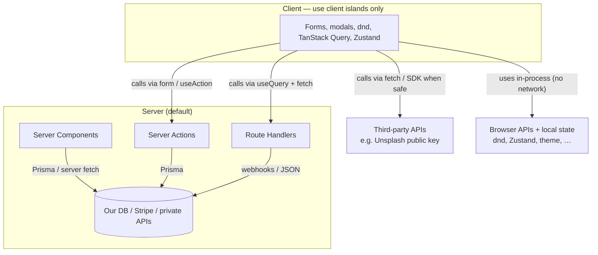
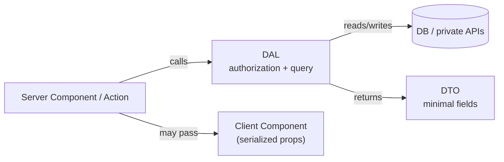

# Fetching and mutating data

How this App Router app **reads** and **writes** data — **what we use where**.

|                 |                                                                                                                           |
| --------------- | ------------------------------------------------------------------------------------------------------------------------- |
| **Owner / SoT** | This file — App Router fetch/mutate map, cache vocabulary, DAL/DTO teaching, when TanStack Query applies                  |
| **Open when**   | Choosing or changing how we load or save data (RSC, Server Actions, Route Handlers, client Query, cache/`revalidatePath`) |

**Do not** re-teach Next.js or TanStack Query APIs here. Prefer official pages, then this map. Catalog / picks: [`conventions.md`](./conventions.md). Index: [`README.md`](./README.md).

**Page shape:** Already following → TODO → Out of scope → deep detail (mental model, decision map, Next thin spots, SPA/Pages orientation).

| Official Next.js                                                                                | Covers                                                                                                                                                                                                                                                  |
| ----------------------------------------------------------------------------------------------- | ------------------------------------------------------------------------------------------------------------------------------------------------------------------------------------------------------------------------------------------------------- |
| [Fetching Data](https://nextjs.org/docs/app/getting-started/fetching-data)                      | **Server** and **Client** Components (incl. streaming, **parallel** fetch, `React.cache`). Client islands here use Route Handler `fetch` + **TanStack Query** ([`conventions.md`](./conventions.md))                                                    |
| [Mutating Data](https://nextjs.org/docs/app/getting-started/mutating-data)                      | **Server Functions / Server Actions** from forms, event handlers, and Client Components                                                                                                                                                                 |
| [Caching](https://nextjs.org/docs/app/getting-started/caching)                                  | **Cache Components** (`use cache`) — **not** what this app uses today; see [out of scope](#out-of-scope-for-now)                                                                                                                                        |
| [Caching (previous model)](https://nextjs.org/docs/app/guides/caching-without-cache-components) | Server `fetch` options, `unstable_cache`, route segment config — closer to how App Router caching worked before Cache Components; we mainly invalidate with **`revalidatePath`**                                                                        |
| [Revalidating](https://nextjs.org/docs/app/getting-started/revalidating)                        | Time-based and on-demand (`revalidatePath` / `revalidateTag`) after mutations — what most of our Actions use today                                                                                                                                      |
| [Forms](https://nextjs.org/docs/app/guides/forms)                                               | Forms + Server Actions; pairs with React [`useActionState`](https://react.dev/reference/react/useActionState) / [`useFormStatus`](https://react.dev/reference/react/useFormStatus) / [`useOptimistic`](https://react.dev/reference/react/useOptimistic) |
| [Server Actions guide](https://nextjs.org/docs/app/guides/server-actions)                       | Next-specific behavior (security, roundtrips, caching)                                                                                                                                                                                                  |
| [Streaming](https://nextjs.org/docs/app/guides/streaming)                                       | `loading.tsx` / Suspense for slow server subtrees — TODO to use more ([`nextjs.md`](./nextjs.md))                                                                                                                                                       |
| [Route Handlers](https://nextjs.org/docs/app/getting-started/route-handlers)                    | `app/api/.../route.ts` HTTP endpoints — webhooks + client JSON; see also [BFF](https://nextjs.org/docs/app/guides/backend-for-frontend)                                                                                                                 |
| [Data Security](https://nextjs.org/docs/app/guides/data-security)                               | Authentication and authorization inside every Action / sensitive server path; also the main place Next recommends **DAL** / **DTO** for new projects                                                                                                    |
| [Backend for Frontend](https://nextjs.org/docs/app/guides/backend-for-frontend)                 | When Next is the **HTTP API layer** (Route Handlers, webhooks, proxying) — not a second product doc; we use that pattern for card JSON + Stripe webhook, not for most UI mutations (those stay Server Actions)                                          |
| [Authentication](https://nextjs.org/docs/app/guides/authentication) (DAL / DTO sections)        | Same **DAL** / **DTO** ideas in an auth-focused walkthrough — see [DAL and DTO](#dal-and-dto-not-auth-only)                                                                                                                                             |
| [Extended `fetch`](https://nextjs.org/docs/app/api-reference/functions/fetch)                   | Server-side `fetch` (`cache` / `revalidate` / `tags`)                                                                                                                                                                                                   |

## Already following (keep as examples)

- **Default read path** — Server Components + Prisma with `orgId` scoping
- **Default write path** — Server Actions under `actions/` with Zod schemas; `createSafeAction` + `ActionState` keyed by failure origin (`fieldErrors` / `formErrors` from the schema, `serverError` from the handler, `data`) — [`conventions.md` → Action validation messages](./conventions.md#action-validation-messages-zod)
- **Client read cache** — TanStack Query + `lib/fetcher.ts` for card modal (and similar client islands)
- **Client Action helper** — `useAction` wrapping safe-action results (see TODO to align with `useActionState`)
- **Route Handlers** — webhooks and client-facing JSON the modal needs; not the primary mutation style
- **Transport picks** — REST → `fetch`; GraphQL → `graphql-request` only if we adopt GraphQL; mocks → MSW — [`testing.md`](./testing.md) · [`conventions.md`](./conventions.md)

**Tip — `React.cache`:** request-scoped memoization for server helpers (same args → same Promise in one RSC render). It is **not** Redis and **not** Next’s Data Cache — see [Cache](#cache-means-different-things-traditional-be-vs-next-vs-client). Use when the same `auth()` / profile helper would otherwise hit Clerk/DB twice per request.

## TODO — clarify / harden data paths

- [ ] **Segment `loading.tsx` / streaming** where slow server fetches hurt UX ([Fetching Data](https://nextjs.org/docs/app/getting-started/fetching-data#streaming), [`nextjs.md`](./nextjs.md))
- [ ] **Expected Action errors as return values** (not throws for validation) — [`nextjs.md`](./nextjs.md) + `create-safe-action`
- [ ] **Authorization on Actions / protected Route Handlers** — checklist in [`authentication-and-authorization.md`](./authentication-and-authorization.md)
- [ ] **TanStack Query patterns** — `prefer-query-options`, provider nesting; guidance in [`conventions.md`](./conventions.md). Add `docs/tanstack-query.md` only if that outgrows a catalog row — see [TanStack Query](#tanstack-query-client-only)
- [ ] **Align Action client UX with `useActionState` / `useFormStatus`** — keep toasts/field-error behavior; prefer React hooks + [Forms](https://nextjs.org/docs/app/guides/forms) over a forever-custom `useAction` ([`useActionState`](https://react.dev/reference/react/useActionState), [`useFormStatus`](https://react.dev/reference/react/useFormStatus))
- [ ] **Unsplash** — whether client + public key stays acceptable vs server-only fetch (production Unsplash app TODO in `lib/unsplash.ts`)
- [ ] **Board image URL allowlist** — constrain `CreateBoard.image` URLs to known Unsplash hosts (and related link hosts) after https-only + `cssUrl` ([`create-board/schema.ts`](../actions/create-board/schema.ts), [`cssUrl`](../lib/utils.ts))
- [ ] **Server-verify Unsplash photo by id** — on create, fetch/confirm the photo server-side and persist those URLs so the client cannot spoof `thumbUrl` / `fullUrl` / attribution ([`create-board`](../actions/create-board/index.ts))
- [ ] **Stronger DAL / DTO** — only if authorization-near-data keeps getting duplicated; don’t invent `dal.ts` for fashion (see [DAL and DTO](#dal-and-dto-not-auth-only))

## Out of scope for now

- GraphQL / `graphql-request` until product needs it
- Replacing Server Actions with “all mutations via Route Handlers”
- Hand-rolling a second ORM next to Prisma
- A big Nest-style DTO/class layer before we feel the need
- Deep **Cache Components** / PPR / ISR redesign, Draft Mode, CDN caching guides — link from [`nextjs.md`](./nextjs.md) when we adopt them; don’t re-teach here
- **Dedicated `tanstack-query.md`** — until Query TODs need more than [`conventions.md`](./conventions.md) + [this map](#tanstack-query-client-only)
- **Ephemeral client UI stores** (modals, sidebars) — [`client-ui-state.md`](./client-ui-state.md); not a data-fetch concern
- **Error handling** file conventions (`error.tsx` / `not-found.tsx`) and Action error-return style — tracked in [`nextjs.md`](./nextjs.md) (related to mutations, but not a second data map)

## Mental model (one picture)

**How to read the arrows:** each arrow is a **call / request** (who initiates work), not “depends on” in a package sense and not “owns.” Responses travel back along the same path; we do not draw return arrows.

| Arrow              | Means                                  |
| ------------------ | -------------------------------------- |
| A → B              | A **calls** B (or uses B’s API)        |
| Label on the arrow | **How** that call is made in this repo |



The client is not limited to “talk to our server.” It also:

- **Calls** third-party HTTP/SDKs when that is safe in the browser (public keys only — see Unsplash today)
- **Uses** browser-only capabilities with no server roundtrip (drag-and-drop, Zustand modals, theme, …)

Still prefer the **server** for secrets, Prisma, and most first-load data. Use the client when you need browser APIs, third-party-from-the-browser (public only), instant client refetch, or rich interactive cache — then Query + `fetch` (or an SDK), not a new ad-hoc `useEffect` stack for everything.

## Decision map (this repo)

### Read (fetch)

| Situation                                                                         | Prefer                                                                                                                                                                                                                | Example in this repo                                                                                        |
| --------------------------------------------------------------------------------- | --------------------------------------------------------------------------------------------------------------------------------------------------------------------------------------------------------------------- | ----------------------------------------------------------------------------------------------------------- |
| Data for a route/layout, no browser-only API                                      | **Server Component** + Prisma (`lib/prisma.ts`) or Next [server `fetch`](https://nextjs.org/docs/app/api-reference/functions/fetch)                                                                                   | Organization home, board page                                                                               |
| Two+ independent server reads on one route                                        | Start them together (don’t `await` A before starting B) — [Fetching Data → parallel](https://nextjs.org/docs/app/getting-started/fetching-data#parallel-data-fetching)                                                | Prefer when a page needs unrelated Prisma/`fetch` results                                                   |
| Same server helper called twice in one request                                    | Wrap with React [`cache`](https://react.dev/reference/react/cache) (Next’s DAL examples do this) — [Sharing data](https://nextjs.org/docs/app/getting-started/fetching-data#sharing-data-with-context-and-reactcache) | Session/`orgId` helpers if extracted; not a Redis cache                                                     |
| Slow server subtree                                                               | Stream: `loading.tsx` / `<Suspense>` — [Fetching Data → streaming](https://nextjs.org/docs/app/getting-started/fetching-data#streaming)                                                                               | Pattern TBD (TODO in [`nextjs.md`](./nextjs.md))                                                            |
| Client needs to load/refetch after mount (modal, poll, dependent on client state) | **TanStack Query** + Web `fetch` (`lib/fetcher.ts`) → usually our **Route Handler**                                                                                                                                   | Card modal → `/api/cards/...`                                                                               |
| Third-party from the **browser** with a secret                                    | Don’t — call from **server** (Action / Route Handler / Server Component)                                                                                                                                              | Prefer server; Unsplash today uses a **public** access key via `unsplash-js` (still `fetch` under the hood) |
| Server Component calling **our own** `app/api` Route Handler                      | **Avoid** — query Prisma / shared `lib/` instead ([production checklist](https://nextjs.org/docs/app/guides/production-checklist#data-fetching-and-caching))                                                          | TODO in [`nextjs.md`](./nextjs.md)                                                                          |

### Write (mutate)

| Situation                                                  | Prefer                                                                                                                                                                                                                                                                                                                                                                                                                                                                                                                                     | Example in this repo                                                                                                                                                |
| ---------------------------------------------------------- | ------------------------------------------------------------------------------------------------------------------------------------------------------------------------------------------------------------------------------------------------------------------------------------------------------------------------------------------------------------------------------------------------------------------------------------------------------------------------------------------------------------------------------------------ | ------------------------------------------------------------------------------------------------------------------------------------------------------------------- |
| UI-driven create/update/delete                             | **Server Action** in `actions/<name>/` + Zod + `create-safe-action`                                                                                                                                                                                                                                                                                                                                                                                                                                                                        | Create board, update card, …                                                                                                                                        |
| Shape of an Action's input                                 | A **typed object** the client assembles (`execute({ … })`), so the schema validates real data. `FormData` earns its place for genuinely uncontrolled inputs, file uploads, dynamic field sets, or a form that must work unhydrated. Never pack several values into one delimited string. When reading `FormData` into that object, **narrow** (`typeof x === "string" ? x : ""`) — do **not** `as string` (`get` is `string \| File \| null`). Copies of `as string` elsewhere are legacy, not a preferred pattern unless this doc says so | `create-board`: `title` narrowed from `FormData`, `image` from [`FormPicker`](../components/form/form-picker.tsx); controlled `title` tracked in the Vitest backlog |
| Client UX around an Action (pending, toasts, field errors) | Today: `hooks/use-action.ts`. Prefer moving toward React [`useActionState`](https://react.dev/reference/react/useActionState) + [`useFormStatus`](https://react.dev/reference/react/useFormStatus) ([Forms](https://nextjs.org/docs/app/guides/forms))                                                                                                                                                                                                                                                                                     | Form popovers, card modal edits                                                                                                                                     |
| Optimistic UI before the Action finishes                   | React [`useOptimistic`](https://react.dev/reference/react/useOptimistic) + Server Actions — [`conventions.md`](./conventions.md#common-practices-catalog); Query optimistic only where Query already owns the cache                                                                                                                                                                                                                                                                                                                        | When needed                                                                                                                                                         |
| After success, refresh **server-rendered** UI              | `revalidatePath` / `revalidateTag` inside the Action — [Mutating Data](https://nextjs.org/docs/app/getting-started/mutating-data)                                                                                                                                                                                                                                                                                                                                                                                                          | Most `actions/*`                                                                                                                                                    |
| After success, refresh **TanStack Query** cache            | `queryClient.invalidateQueries` on the client                                                                                                                                                                                                                                                                                                                                                                                                                                                                                              | Card modal header/description                                                                                                                                       |
| Stripe / Clerk / other **inbound HTTP**                    | **Route Handler** (`app/api/webhook`, …)                                                                                                                                                                                                                                                                                                                                                                                                                                                                                                   | [`billing.md`](./billing.md)                                                                                                                                        |
| Parallel fire-and-forget client fetches                    | Not Server Actions’ strength (often sequential) — fetch on server or one Action / Route Handler — [Mutating Data](https://nextjs.org/docs/app/getting-started/mutating-data)                                                                                                                                                                                                                                                                                                                                                               | —                                                                                                                                                                   |

### TanStack Query (client only)

**Yes — it is part of this repo’s data story**, but only for **browser islands** that must load/refetch after mount. Default page data stays Server Components + Prisma; most form saves stay Server Actions. Do **not** invent a separate `tanstack-query.md` until Query-specific guidance outgrows the catalog row (same bar as Clerk/Prisma getting their own pages).

| Concern                                                         | Where it lives                                                                                                                                                  |
| --------------------------------------------------------------- | --------------------------------------------------------------------------------------------------------------------------------------------------------------- |
| **When / where** to use Query vs RSC vs Actions                 | **This file** — decision map above, mental model, [cache vocabulary](#cache-means-different-things-traditional-be-vs-next-vs-client) (Query ≠ `revalidatePath`) |
| **Adopted pick** (Query + `fetch`, avoid SWR, optimistic rules) | [`conventions.md`](./conventions.md#common-practices-catalog)                                                                                                   |
| **How** (`useQuery`, keys, staleTime, …)                        | [TanStack Query docs](https://tanstack.com/query/latest/docs/framework/react/overview)                                                                          |
| **Transport**                                                   | Web `fetch` via [`lib/fetcher.ts`](../lib/fetcher.ts) — not Next’s server `fetch`                                                                               |

**In this repo today:** card modal (`components/modals/card-modal`) — `useQuery` → Route Handlers; after Action success, `queryClient.invalidateQueries`. Provider: `providers/query-provider.tsx`.

## Where Next is thin (teach here)

Next’s guides name some patterns without a full mental model. Official snippets stay authoritative for APIs; the sections below disambiguate vocabulary and fill gaps.

### Cache means different things (traditional BE vs Next vs client)

**Do not** open a separate `cache.md` for this — it belongs next to fetching/mutating. Official depth stays in Next’s pages; this section only stops vocabulary collisions.

In a **traditional backend**, “cache” usually means something **you provision and invalidate yourself**:

| Traditional meaning                    | Examples                                                          | In this app?                                                                                   |
| -------------------------------------- | ----------------------------------------------------------------- | ---------------------------------------------------------------------------------------------- |
| **Application / data store cache**     | Redis, Memcached, in-process LRU in front of the DB or a slow API | **No** dedicated Redis/Memcached layer today                                                   |
| **HTTP / CDN cache**                   | `Cache-Control`, reverse proxy, CDN edge                          | Platform/CDN may cache static assets; we are **not** designing product data around CDN caching |
| **ORM / DB buffer**                    | Driver pools, query result buffers                                | Opaque to us — not “Next cache”                                                                |
| **“Cached” = memoized in one request** | Same helper called twice, reuse the Promise                       | Closest cousin: React [`cache`](https://react.dev/reference/react/cache) during one RSC render |

In **Next.js App Router**, “cache” is mostly **framework behavior** around rendering and server `fetch` — not “we installed Redis.” Docs also split into two eras:

| Next meaning         | What it is                                                                                                             | Our stance                                                                                                                                                                                                                                                                                        |
| -------------------- | ---------------------------------------------------------------------------------------------------------------------- | ------------------------------------------------------------------------------------------------------------------------------------------------------------------------------------------------------------------------------------------------------------------------------------------------- |
| **Previous model**   | Optional caching of server `fetch` / `unstable_cache` / full route; invalidate with `revalidatePath` / `revalidateTag` | **This repo today** — Actions call **`revalidatePath`**. We do **not** lean on a big `force-cache` / ISR setup. Guide: [Caching (previous model)](https://nextjs.org/docs/app/guides/caching-without-cache-components) · [Revalidating](https://nextjs.org/docs/app/getting-started/revalidating) |
| **Cache Components** | `"use cache"` / `cacheLife` / `cacheComponents: true`                                                                  | **Out of scope** until we deliberately adopt it — [Getting Started: Caching](https://nextjs.org/docs/app/getting-started/caching), [`nextjs.md`](./nextjs.md)                                                                                                                                     |

Same word in **this stack** (neither Redis nor “the Next Data Cache”):

| Cache                      | Where   | What we do                                                                                                                                                                                                |
| -------------------------- | ------- | --------------------------------------------------------------------------------------------------------------------------------------------------------------------------------------------------------- |
| **Prisma / DB roundtrips** | Server  | **Not** Next’s Data Cache. Same query in two Server Components can hit the DB twice unless you dedupe with React [`cache`](https://react.dev/reference/react/cache) or share one await higher in the tree |
| **TanStack Query**         | Browser | Client-only. Invalidate with `queryClient.invalidateQueries` — **independent** of `revalidatePath`                                                                                                        |

**Rule of thumb:** if someone from a Nest/Rails/Spring team says “add a cache,” ask **which** — Redis in front of Postgres, CDN headers, Next `revalidatePath`, or Query `invalidateQueries`. Those are different tools.

**Server `fetch` ≠ `lib/fetcher.ts`:** Next’s extended `fetch` is for the **server**; the client helper is ordinary Web `fetch` for Query — see [`lib/fetcher.ts`](../lib/fetcher.ts).

Short definition: [`vocabulary.md`](./vocabulary.md).

### DAL and DTO (not auth-only)

These terms are **not** Next.js framework APIs. They are ordinary server-side design patterns that Next’s newer App Router security docs started recommending by name. Older Next material rarely used **DAL** / **DTO** this way — so if they feel new, that is expected.

#### Do Next’s docs explain them well?

**Partly.** [Data Security](https://nextjs.org/docs/app/guides/data-security#data-access-layer) and [Authentication](https://nextjs.org/docs/app/guides/authentication#creating-a-data-access-layer-dal) include working snippets (`verifySession`, `getProfileDTO`, field-level `canSee*` helpers). That is enough to copy a shape.

They are **thin** on a mental model:

- They assume you already know “layer + transfer object” from backends (Nest, Spring, …)
- Authentication and Data Security **split the folders differently** (`dal.ts` + `dto.ts` vs one `user-dto` module) without saying which layout is required
- Next itself says DTO styles (`toJSON()`, functions, classes) are **JavaScript patterns**, not a Next feature — “do some research”
- Cross-links (production checklist, `"use server"`, unauthorized/forbidden examples) mostly **name** DAL, not teach it

So: use Next for **examples and the security checklist**; use **this section** for what the words mean and how they fit this app.

#### What each word means

| Term                           | Job                                                        | One sentence                                                                                                                               |
| ------------------------------ | ---------------------------------------------------------- | ------------------------------------------------------------------------------------------------------------------------------------------ |
| **Data Access Layer (DAL)**    | **Who** may touch the database / private APIs, and **how** | Server-only module(s) that run **authentication** / **authorization**, talk to Prisma (or Stripe, …), and decide what leaves the module    |
| **Data Transfer Object (DTO)** | **What** is allowed to leave                               | The **safe, minimal** object returned to a Server Component, Action caller, or (after serialization) a Client Component — not a raw DB row |

Relationship: the DAL **produces** DTOs. A DTO is not a separate runtime framework; it is the **return shape** (plain object, typed alias, mapper function, class — pick one style and stay consistent).



**How to read:** the page/action never talks to the DB directly; only the DAL does. What flows toward the client is a **DTO**, not a raw row. (Same arrow rule as [Mental model](#mental-model-one-picture): arrows are calls; the DTO is the return value of the DAL call.)

Closest familiar ideas: guarded repository / service (DAL); safe response shape / “don’t return the entity” (DTO). Same jobs appear under other names in Nest, FastAPI, Rails, Spring, etc. — see those ecosystems’ docs if you already know them; don’t copy their decorator stacks into this App Router app.

#### Why App Router makes this hurt more than Pages Router

In Pages Router you often fetched in `getServerSideProps` or an API route and **chose** a JSON body. Accidental over-sharing still happened, but the HTTP boundary was obvious.

In App Router, a Server Component can `await prisma…` and pass the result into a Client Component as props. Those props are **serialized across the server→client boundary**. If you pass a full Prisma row (or anything with secrets / extra PII), the client bundle receives it. Authorization that only lived in middleware / Proxy / layout is **not** enough — every data path must re-check.

That is the problem DAL + DTO are answering: **authorization next to the query**, **minimal fields out**.

#### Unsafe vs safer (board-shaped example)

**Unsafe (component-level data access — fine for demos, risky as the default):**

```tsx
// Server Component page
const board = await prisma.board.findUnique({ where: { id } });
// If <BoardHeader> is a Client Component, every column on `board` crosses to the browser.
return <BoardHeader board={board} />;
```

Missing: is this board in the viewer’s organization? Should the client see internal timestamps / Stripe linkage / audit fields you might add later?

**Safer idea (DAL returns a DTO):**

```ts
// Conceptual — not a file we have yet
import "server-only";
import { auth } from "@clerk/nextjs/server";
import prisma from "@/lib/prisma";

export type BoardHeaderDTO = {
  id: string;
  title: string;
  imageThumbUrl: string;
};

export async function getBoardHeaderDTO(
  boardId: string,
): Promise<BoardHeaderDTO | null> {
  const { orgId } = await auth();
  if (!orgId) return null;

  const board = await prisma.board.findUnique({
    where: { id: boardId, orgId }, // authorization: org scope
    select: { id: true, title: true, imageThumbUrl: true }, // DTO fields only
  });
  if (!board) return null;

  return {
    id: board.id,
    title: board.title,
    imageThumbUrl: board.imageThumbUrl,
  };
}
```

```tsx
// Server Component — only the DTO is safe to pass toward the client
const board = await getBoardHeaderDTO(id);
if (!board) notFound();
return <BoardHeader board={board} />;
```

Same idea for **mutations**: a thin `"use server"` action validates input, then calls something like `deleteBoardInOrg(boardId)` inside `server-only` code that re-checks `orgId` and ownership. Next documents that under [Using a Data Access Layer for mutations](https://nextjs.org/docs/app/guides/data-security#using-a-data-access-layer-for-mutations).

You do **not** need a class named `BoardDTO` or a Nest-style `class-validator` stack. A TypeScript type + an explicit `return { … }` (or Prisma `select`) **is** a DTO.

#### This repo today

No formal `lib/dal.ts`. Authorization + Prisma live mainly in **Server Actions** / Route Handlers / helpers (`orgId` in `where`) — Next’s “component-level data access” path. Folder catalog already allows `queries/` / `repositories/` [when needed](./project-structure.md#common-practice-folders).

Extract a real DAL when the same authorization + select rules are copy-pasted, or a security review says “too easy to pass whole rows.” Do **not** invent `dal.ts` for fashion.

Spell out **Data Access Layer** / **Data Transfer Object** on first use in prose; **DAL** / **DTO** are OK after that (unlike abbreviating authentication / authorization). Short definitions: [`vocabulary.md`](./vocabulary.md).

Next also names these in [Data Security](https://nextjs.org/docs/app/guides/data-security#data-access-layer) (primary), [Authentication](https://nextjs.org/docs/app/guides/authentication#creating-a-data-access-layer-dal), and cross-links from the production checklist / Server Actions / `use server` / unauthorized·forbidden examples.

## If you came from SPA or Pages Router

Skip this section if App Router is already your default. It only remaps old habits onto [the decision map](#decision-map-this-repo) above.

### SPA + separate API vs “BFF” (why the name confuses people)

If you never used Next.js and only built a **SPA in one repo** and a **traditional API in another**, you usually thought:

**Browser app → HTTP → backend**

That already _is_ client–server. People rarely called the API a **BFF** (“Backend for Frontend”); it was just “the backend.”

A big difference in audience:

|                    | Traditional separate backend                                                              | BFF (incl. Next Route Handlers)                                                                                                  |
| ------------------ | ----------------------------------------------------------------------------------------- | -------------------------------------------------------------------------------------------------------------------------------- |
| **Who it serves**  | Often **many** clients — this web app, mobile apps, other services, partners, admin tools | Primarily **one** frontend (here: this Next.js app)                                                                              |
| **API shape**      | Shared contracts; not tuned to one UI’s screens                                           | Shaped for that UI (hide secrets, aggregate calls, match page/modal needs)                                                       |
| **Where it lives** | Usually its own repo / deploy                                                             | Often **same project** as the UI in Next ([Backend for Frontend guide](https://nextjs.org/docs/app/guides/backend-for-frontend)) |

So the traditional server is not “missing a middle layer” — it **is** the server, and it frequently outlives any single SPA. BFF is not “we invented a third tier that never existed.” It is a **name** for an HTTP API **for this frontend**, which in Next often sits beside Server Components / Server Actions that talk to the DB **without** going through those HTTP endpoints.

| Setup                       | What you had                                                                                                                                            |
| --------------------------- | ------------------------------------------------------------------------------------------------------------------------------------------------------- |
| SPA repo + API repo         | Client → separate backend that may also serve mobile / other apps (no one says “BFF”)                                                                   |
| Next App Router (this repo) | UI **plus** optional same-app HTTP endpoints (`app/api/...`) **plus** Server Components / Server Actions that skip that HTTP path for most reads/writes |

In this app: card modal JSON + Stripe webhook use the HTTP (BFF-style) layer; most form saves use **Server Actions**, not a new `/api` for every mutation.

#### If we later serve more than this Next.js client

**Not automatic:** “we have a BFF now ⇒ we must migrate it to a separate BE (+ Turborepo).” That is **one** option when a second real client appears (mobile, public API, another web app).

What we have today is a **thin** same-app HTTP layer plus a lot of logic in Server Actions / Prisma — not a full standalone API product. Growth choices:

| Approach                                                                         | When it fits                                                                                                                                                                                                                 |
| -------------------------------------------------------------------------------- | ---------------------------------------------------------------------------------------------------------------------------------------------------------------------------------------------------------------------------- |
| **Keep Next as web BFF** + add a **shared API** (or service) for mobile / others | Second client needs stable HTTP; web can keep RSC/Actions and optionally still use Route Handlers for web-only needs                                                                                                         |
| **Extract domain logic** into shared packages; Next + API both import them       | Avoid duplicating Prisma/rules — [Turborepo](https://turbo.build/repo/docs) / pnpm workspaces is a common packaging choice (**optional**, only when a second app/package is real — see [`conventions.md`](./conventions.md)) |
| **Move “the” API out of Next** and make the web app a client of that API         | Only if web also wants to stop relying on Server Actions / in-process Prisma for those paths — bigger migration, not the default first step                                                                                  |

Turborepo does **not** create a backend by itself; it only helps a **monorepo** share code across apps. Don’t invent a separate BE or monorepo until a second client (or clear API product) forces it — product decision, same spirit as authentication-provider / billing-provider exits.

### Pages Router → App Router (why it feels confusing)

If you only knew **Pages Router**, you probably thought:

1. Pages are React components that run in the **browser**
2. Data load = `useEffect` + `fetch`, or `getServerSideProps` / `getStaticProps`
3. Mutations = `fetch` to **`pages/api/*`**
4. “Server” mostly meant API routes and `get*Props`, not the component tree itself

In the **App Router**, the default page/layout is a **Server Component**: it runs on the server, can `await` the DB / `fetch`, and **does not** ship that code to the client. `"use client"` marks an island that _does_ run in the browser.

| Old habit (Pages)                                       | App Router default here                                                                     |
| ------------------------------------------------------- | ------------------------------------------------------------------------------------------- |
| `useEffect` + `fetch('/api/...')` for initial page data | **Server Component** + Prisma / server `fetch` in the page or a child server component      |
| `pages/api` for form saves                              | **Server Action** under `actions/` (called from forms / `useAction`)                        |
| `pages/api` for webhooks / external HTTP                | Still a **Route Handler** — `app/api/.../route.ts`                                          |
| Client cache library for everything                     | **TanStack Query** only where the **client** must refetch (e.g. card modal)                 |
| “I need an API route so the client can load X”          | Often **no** — load X on the server and pass props, or stream with `loading.tsx` / Suspense |

Server Actions are reachable by POST (not only your UI). Always verify **authentication** and **authorization** inside them — see [`authentication-and-authorization.md`](./authentication-and-authorization.md) and [Data Security](https://nextjs.org/docs/app/guides/data-security).
