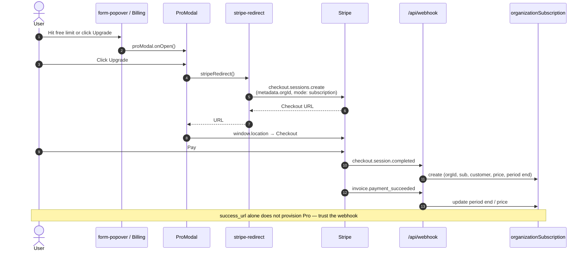
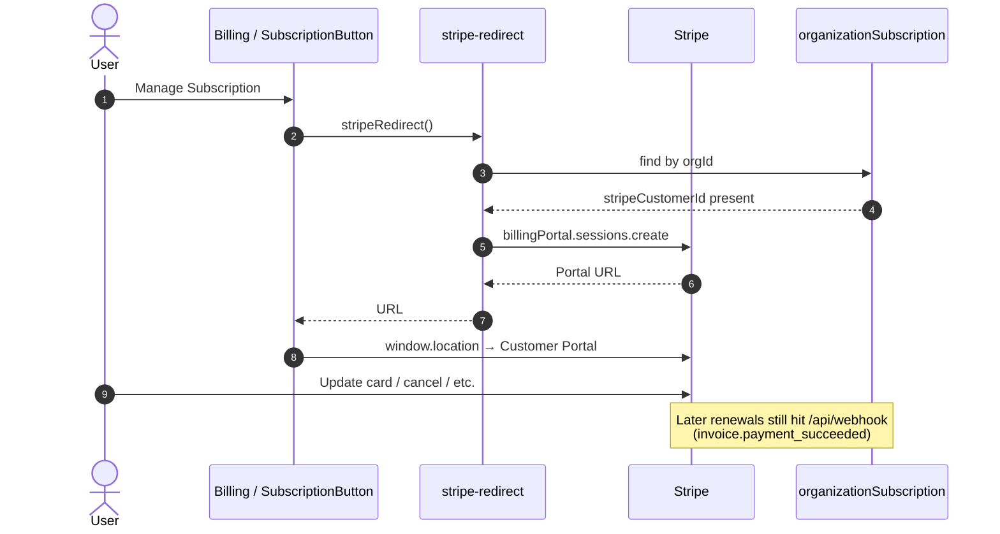

# Stripe billing in Taskify

How Taskify Pro subscriptions work in this repo. Inline comments explain *why* a
line exists; this page is the bird’s-eye view. Diagrams and the file map can drift
when UI entry points change — update them when the flow changes.

Official Stripe docs: [Webhooks](https://docs.stripe.com/webhooks) ·
[Subscription webhooks](https://docs.stripe.com/billing/subscriptions/webhooks)

## Happy path — first upgrade

Entry points: free-board limit (`form-popover`) or Billing page **Upgrade to Pro**
(`SubscriptionButton` → Pro modal).



## Returning customer — manage billing

Pro users on the Billing page call `stripeRedirect` **directly** (no Pro modal) →
Customer Portal.



## Component map

Paths change — treat this as a starting index, not a contract. Prefer searching
the repo (`checkSubscription`, `stripeRedirect`, `organizationSubscription`) when
in doubt.

| Piece | Path | Role |
| ----- | ---- | ---- |
| Free-limit trigger | `components/form/form-popover.tsx` | Opens Pro modal on create-board errors |
| Billing page | `organization/[organizationId]/billing/` | Shows plan via `Info` + `SubscriptionButton` |
| Subscription CTA | `billing/_components/subscription-button.tsx` | Free → Pro modal; Pro → `stripeRedirect` (Portal) |
| Modal store | `hooks/use-pro-modal.ts` | Client open/close state |
| Upgrade UI | `components/modals/pro-modal.tsx` | Calls `stripeRedirect`, navigates to Stripe URL |
| Server action | `actions/stripe-redirect/index.ts` | Checkout (new) or Customer Portal (existing) |
| Stripe client | `lib/stripe.ts` | SDK instance + `stripeTimestampToDate` |
| Webhook | `app/api/webhook/route.ts` | Verifies signature; creates/updates DB row |
| Auth gate | `proxy.ts` | `/api/webhook` is public (Stripe has no Clerk session) |
| Pro check | `lib/subscription.ts` | `checkSubscription` — used by billing UI, board limits, org pages |
| Persistence | `prisma/schema.prisma` → `OrganizationSubscription` | Links Clerk `orgId` ↔ Stripe IDs |

## Data we store

Webhook writes / updates `OrganizationSubscription` (see field-level **why** comments in
`prisma/schema.prisma`). Short summary:

- `orgId` — Clerk org; from Checkout `metadata` (set in `stripe-redirect`)
- `stripeCustomerId` — open Customer Portal later
- `stripeSubscriptionId` — renewal webhook lookups (invoices have no org metadata)
- `stripePriceId` / `stripeCurrentPeriodEnd` — which plan is active and until when (`checkSubscription`)

## Local webhook testing

```bash
stripe listen --forward-to localhost:3000/api/webhook
```

Put the printed `whsec_...` into `STRIPE_WEBHOOK_SECRET` (CLI secret ≠ Dashboard endpoint secret).

## Older Stripe API notes

Tutorial / API-version diffs (2023-10-16 → later Invoice/Subscription shape) are a
**frozen archive** at the bottom of `app/api/webhook/route.ts`. Live handler code
above that block is the source of truth — don’t expect the archive to track every
Stripe version bump.
